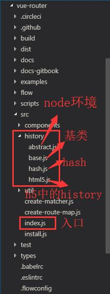

## 路由router

### 背景

        在现在这些MVC和MVVM框架兴起之前，是不存在前端路由的，页面之间的跳转是由后台控制的。随着前后端分离和单页面应用（SPA）的兴起和WEB项目复杂度的增加，再加上前面这些框架的支持，慢慢前端路由也就成为了现实。单页面应用的特点就是可以在改变URL在不重新请求页面的情况下更新页面视图。目前在浏览器环境中这一功能的实现主要有两种方式
            利用URL中的hash（"#"）
            利用History interface在 HTML5中新增的方法
        
        hash 能兼容到IE8， history 只能兼容到 IE10
        
        history 模式改变 url 的方式会导致浏览器向服务器发送请求，这不是我们想看到的，我们需要在服务器端做处理：如果匹配不到任何静态资源，则应该始终返回同一个 html 页面。
        
        首先，hash 本来是拿来做页面定位的，如果拿来做路由的话，原来的锚点功能就不能用了。其次，hash 的传参是基于 url 的，如果要传递复杂的数据，会有体积的限制，而 history 模式不仅可以在url里放参数，还可以将数据存放在一个特定的对象中。
        最重要的一点：
            如果不想要很丑的 hash，我们可以用路由的 history 模式
                                      —— 引用自 vueRouter文档 

### history

#### 属性

*  host:域名+端口号
*  hostname:域名
*  port:端口号
*  protocol:协议
*  href：完整路径
*  origin：协议+域名+端口
*  hash：井号 (#) 开始的 URL(hash)
*  pathname:文档路径+文档名
*  search:(?)后面的内容

#### API

        window.history.pushState(state, title, url) 
            // state：需要保存的数据，这个数据在触发popstate事件时，可以在event.state里获取
            // title：标题，基本没用，一般传 null
            // url：  设定新的历史记录的 url。新的 url 与当前 url 的 origin 必须是一样的，否则会抛出错误。url可以是绝对路径，也可以是相对路径。
            // 如 当前url是 https://www.baidu.com/a/,执行history.pushState(null, null, './qq/')，则变成 https://www.baidu.com/a/qq/，
            // 执行history.pushState(null, null, '/qq/')，则变成 https://www.baidu.com/qq/

        window.history.replaceState(state, title, url)
            // 与 pushState 基本相同，但它是修改当前历史记录，而 pushState 是创建新的历史记录

        window.addEventListener("popstate", function() {
            // 监听浏览器前进后退事件，pushState 与 replaceState 方法不会触发              
        });

        window.history.back() // 后退
        window.history.forward() // 前进
        window.history.go(1) // 前进一步，-2为后退两步，window.history.length 可以查看当前历史堆栈中页面的数量

### hash

##### hash介绍

*        这里的 hash 就是指 url 后的 # 号以及后面的字符。这里的 # 和 css 里的 # 是一个意思(#是id属性)。
*        hash 也 称作 锚点，本身是用来做页面定位的，它可以使对应 id 的元素显示在可视区域内。
*        由于 hash 值变化不会导致浏览器向服务器发出请求，虽然出现在URL中，但不会被包括在HTTP请求中。
*        它是用来指导浏览器动作的，对服务器端完全无用，因此，改变hash不会重新加载页面
*        而且 hash 改变会触发 hashchange 事件，浏览器的进后退也能对其进行控制，
*        所以人们在 html5 的 history 出现前，基本都是使用 hash 来实现前端路由的。

#### API 

        window.location.hash = 'qq'         // 设置 url 的 hash，会在当前url后加上 '#qq'
                                            // 就算赋值的时候没有加# hash 也会自动加# 如果赋值时有一个# 则相当于是默认的#，如果赋值时添加2个以上的#，则最后用hash值来匹配路由的时候是总数量减1个#，所以在匹配路由的时候经常会从1这个位置来截取
        var hash = window.location.hash     // 获取hash值 '#qq'  
        window.location.replace(url)        
        window.addEventListener('hashchange', function(){ 
            // 监听hash变化，点击浏览器的前进后退会触发
        })

##### hash原生API 的应用

        eg:  
            window.location.hash = 'qq' 或者  window.location.hash = '#qq'     
            window.location.hash 值为 #qq
            用hash来控制路由时，window.location.hash.substring(1)来获取hash内容qq，来进行匹配路由
        
            window.location.hash = '##qq'     
            window.location.hash 值为 ##qq
            用hash来控制路由时，window.location.hash.substring(1)来获取hash内容#qq，来进行匹配路由

##### 用随机数的方式生成hash值，同时改变hash 并展示到页面当中

        <!DOCTYPE html>
        <html lang="en">
            <head>
                <meta charset="UTF-8">
                <title>Document</title>
                
            </head>
            <body>
                
 
                <input type="submit" value="触发按钮">
                
                

            </body>
        </html>

##### 模拟Vue-router的实现

            <!DOCTYPE html>
            <html lang="en">
                <head>
                    <meta charset="UTF-8">
                    <title>Document</title>
                    
                </head>
                <body>
                    <header>这里是头部</header>
                    <nav>
                        <li> <a href="#/">a</a>    </li>
                        <li> <a href="#/01">b</a>  </li>
                        <li> <a href="#/02">c</a>  </li>
                        <li> <a href="#/03">d</a>  </li>
                        <li> <a href="#/04">e</a>  </li>
                        <li> <a href="#/05">f</a>  </li>
                    </nav>
                    <section>
                        如果想看路由改变效果，请点击上边的链接
                    </section>
                    

                    <footer>这里是尾部</footer>
                </body>
            </html>

### hash 和 history 对比

|   维度   |   hash   |  history |
| :------: | :------: | :------: |
| push | location.hash | history.pushState |
| replace | location.replace | history.replace |
| 监听变化 | window.onhashchange | window.onpopstate |

### vue-router 源码解读
    vue-router是Vue.js框架的路由插件，下面我们从它的源码入手，边看代码边看原理，看vue-router是如何通过这两种方式实现前端路由的。

##### 模式参数
    在vue-router中是通过mode这一参数控制路由的实现模式的：

    创建VueRouter的实例对象时，mode以构造函数参数的形式传入。

        const router = new VueRouter({
            mode: 'history',
            routes: [...]
        })
##### index.js
    带着问题阅读源码，我们就可以从VueRouter类的定义入手。一般插件对外暴露的类都是定义在源码src根目录下的index.js文件中，打开该文件，可以看到VueRouter类的定义，摘录与mode参数有关的部分如下：

        export default class VueRouter {
            static install: () => void;
            static version: string;

            app: any;
            apps: Array<any>;
            ready: boolean;
            readyCbs: Array<Function>;
            options: RouterOptions;
            // 传入的字符串参数，指示history类别
            mode: string;  
            // 实际起作用的对象属性，必须是以上三个类的枚举  AbstractHistory是node环境使用的
            history: HashHistory | HTML5History | AbstractHistory; 
            matcher: Matcher;
            fallback: boolean;   // 如浏览器不支持，'history'模式需回滚为'hash'模式
            beforeHooks: Array<?NavigationGuard>;
            resolveHooks: Array<?NavigationGuard>;
            afterHooks: Array<?AfterNavigationHook>;

            constructor (options: RouterOptions = {}) {
                this.app = null
                this.apps = []
                this.options = options
                this.beforeHooks = []
                this.resolveHooks = []
                this.afterHooks = []
                this.matcher = createMatcher(options.routes || [], this)

                // 'history'模式需回滚为'hash'模式 的判断 start
                let mode = options.mode || 'hash'
                // mode配置的是history 但是当前浏览器不支持history(通过是否支持history的pushstate方法判断)并且 fallback为ture 则回滚为 hash 模式
                this.fallback = mode === 'history' && !supportsPushState && options.fallback !== false
                if (this.fallback) {
                    mode = 'hash'
                }
                // 'history'模式需回滚为'hash'模式 的判断 end
                // 非浏览器环境 比如node
                if (!inBrowser) {
                mode = 'abstract'
                }
                this.mode = mode

                // 根据mode 和当前的环境 进行 实例化history
                switch (mode) {
                    case 'history':
                        this.history = new HTML5History(this, options.base)
                        break
                    case 'hash':
                        this.history = new HashHistory(this, options.base, this.fallback)
                        break
                    case 'abstract':
                        this.history = new AbstractHistory(this, options.base)
                        break
                    default:
                        if (process.env.NODE_ENV !== 'production') {
                            assert(false, `invalid mode: ${mode}`)
                        }
                }
            }
            ....
            // app 是vue组件的实例
            init (app: any /* Vue component instance */) {
                process.env.NODE_ENV !== 'production' && assert(
                    install.installed,
                    `not installed. Make sure to call \`Vue.use(VueRouter)\` ` +
                    `before creating root instance.`
                )

                this.apps.push(app)

                // main app already initialized.
                if (this.app) {
                    return
                }

                this.app = app

                const history = this.history

                // 根据history的类别执行相应的初始化操作和监听
                if (history instanceof HTML5History) {
                    history.transitionTo(history.getCurrentLocation())
                } else if (history instanceof HashHistory) {
                    const setupHashListener = () => {
                        history.setupListeners()
                    }
                    history.transitionTo(
                        history.getCurrentLocation(),
                        setupHashListener,
                        setupHashListener
                    )
                }

                // history listen 监听事件
                //为hash.js 中注册cd的方法 
                //为vue 组件实例app添加 app._route   在hash.js 中transitionTo的方法中有用到
                history.listen(route => {
                    this.apps.forEach((app) => {
                        app._route = route
                    })
                })
            }
            ....
            // VueRouter类暴露的以下方法实际是调用具体history对象的方法
            // push 时  执行的方法
            push (location: RawLocation, onComplete?: Function, onAbort?: Function) {
                this.history.push(location, onComplete, onAbort)
            }
            // replace 时  执行的方法
            replace (location: RawLocation, onComplete?: Function, onAbort?: Function) {
                this.history.replace(location, onComplete, onAbort)
            }

        }
###### index.js 的总结
* 作为参数传入的字符串属性mode只是一个标记，用来指示实际起作用的对象属性history的实现类，两者对应关系如下：
    mode 'history'   HTML5History
         'hash'      HashHistory
         'abstract'  AbstractHistory
         
* 在初始化对应的history之前，会对mode做一些校验：若浏览器不支持HTML5History方式（通过supportsPushState变量判断），则mode强制设为'hash'；若不是在浏览器环境下运行，则mode强制设为'abstract'

* VueRouter类中的onReady(), push()等方法只是一个代理，实际是调用的具体history对象的对应方法，在init()方法中初始化时，也是根据history对象具体的类别执行不同操作方法

* 在浏览器环境下的两种方式，分别就是在HTML5History，HashHistory两个类中实现的。都定义在src/history文件夹下，继承自同目录下base.js文件中定义的History类。History中定义的是公用和基础的方法，我们先从HTML5History，HashHistory两个类中看着亲切的push(), replace()方法的说起。

##### hash.js 

        // HashHistory 继承 base.js 中的History
        export class HashHistory extends History {
            constructor (router: Router, base: ?string, fallback: boolean) {
                super(router, base)
                // check history fallback deeplinking
                if (fallback && checkFallback(this.base)) {
                return
                }
                ensureSlash()
            }

            // this is delayed until the app mounts
            // to avoid the hashchange listener being fired too early
            
            // 监听
            setupListeners () {
                const router = this.router
                const expectScroll = router.options.scrollBehavior
                const supportsScroll = supportsPushState && expectScroll

                if (supportsScroll) {
                    setupScroll()
                }

                // 监听浏览器地址栏中路由的变化
                // 设置监听了浏览器事件hashchange，调用的函数为replaceHash，即在浏览器地址栏中直接输入路由相当于代码调用了replace()方法
                window.addEventListener(supportsPushState ? 'popstate' : 'hashchange', () => {
                    const current = this.current
                    if (!ensureSlash()) {
                        return
                    }
                    this.transitionTo(getHash(), route => {
                        if (supportsScroll) {
                            handleScroll(this.router, route, current, true)
                        }
                        if (!supportsPushState) {
                            replaceHash(route.fullPath)
                        }
                    })
                })
            }

            // HashHistory中的push()方法  ?: 是typescript 语法
            // 调用 pushHash 方法
            push (location: RawLocation, onComplete?: Function, onAbort?: Function) {
                const { current: fromRoute } = this
                this.transitionTo(location, route => {
                    pushHash(route.fullPath)
                    handleScroll(this.router, route, fromRoute, false)
                    onComplete && onComplete(route)
                }, onAbort)
            }

            // HashHistory中的replace()方法
            // 调用 replaceHash 方法
            replace (location: RawLocation, onComplete?: Function, onAbort?: Function) {
                const { current: fromRoute } = this
                // 此方法在base中定义  监测更新，更新则调用History.updateRoute()
                this.transitionTo(location, route => {
                    replaceHash(route.fullPath)
                    handleScroll(this.router, route, fromRoute, false)
                    onComplete && onComplete(route)
                }, onAbort)
            }
            ....
            function pushHash (path) {
                if (supportsPushState) {
                    pushState(getUrl(path))
                } else {
                    window.location.hash = path
                }
            }
            // replace()方法替换掉当前的路由  直接调用window.location.replace(url),不会让h5 中的history的length增加
            function replaceHash (path) {
                if (supportsPushState) {
                    replaceState(getUrl(path))
                } else {
                    window.location.replace(getUrl(path))
                }
            }
        }
###### hash.js 用到的 base.js 中的方法讲解

        // listen 方法中cb 的赋值
        // cb 方法是在 index.js中history.listen中定义的
        listen (cb: Function) {
            this.cb = cb
        }
        ...
        // hash.js 中push 和replace 中用到的transitionTo
        // 调用了 updateRoute方法
        transitionTo (location: RawLocation, onComplete?: Function, onAbort?: Function) {
            const route = this.router.match(location, this.current)
            this.confirmTransition(route, () => {
                this.updateRoute(route)
                onComplete && onComplete(route)
                this.ensureURL()

                // fire ready cbs once
                if (!this.ready) {
                    this.ready = true
                    this.readyCbs.forEach(cb => { cb(route) })
                }
                }, err => {
                if (onAbort) {
                    onAbort(err)
                }
                if (err && !this.ready) {
                    this.ready = true
                    this.readyErrorCbs.forEach(cb => { cb(err) })
                }
            })
        }
        ...
        // updateRoute方法 中调用了cb  cb 方法是在listen 中赋值的
        updateRoute (route: Route) {
            const prev = this.current
            this.current = route
            this.cb && this.cb(route)
            this.router.afterHooks.forEach(hook => {
                hook && hook(route, prev)
            })
        }
###### install.js   解释_route的来源
    根据注释，app为Vue组件实例，但我们知道Vue作为渐进式的前端框架，本身的组件定义中应该是没有有关路由内置属性_route，如果组件中要有这个属性，应该是在插件加载的地方，即VueRouter的install()方法中混合入Vue对象的，查看install.js源码，有如下一段：

    Vue.mixin({
        beforeCreate () {
        if (isDef(this.$options.router)) {
            this._routerRoot = this
            this._router = this.$options.router
            this._router.init(this)
            Vue.util.defineReactive(this, '_route', this._router.history.current)
        } else {
            this._routerRoot = (this.$parent && this.$parent._routerRoot) || this
        }
        registerInstance(this, this)
        },
        destroyed () {
            registerInstance(this)
        }
    })

    通过Vue.mixin()方法，全局注册一个混合，影响注册之后所有创建的每个 Vue 实例，该混合在beforeCreate钩子中通过Vue.util.defineReactive()定义了响应式的_route属性。所谓响应式属性，即当_route值改变时，会自动调用Vue实例的render()方法，更新视图。

###### 从设置路由改变到视图更新的流程如下：
        $router.push() --> HashHistory.push() --> History.transitionTo() --> History.updateRoute() --> {app._route = route} --> vm.render()

###### hash.js 总结
*       $router.push() //调用方法
*       HashHistory.push() //根据hash模式调用,设置hash并添加到浏览器历史记录（添加到栈顶）（window.location.hash= XXX）
*       History.transitionTo() //监测更新，更新则调用History.updateRoute()
*       History.updateRoute() //更新路由
*       {app._route= route} //替换当前app路由
*       vm.render() //更新视图
*       transitionTo()方法是父类中定义的是用来处理路由变化中的基础逻辑的，push()方法最主要的是对window的hash进行了直接赋值
*       replace()方法与push()方法不同之处在于，它并不是将新路由添加到浏览器访问历史的栈顶，而是替换掉当前的路由

###### 监听地址栏
        push() 和 replace()是可以在vue组件的逻辑代码中直接调用的，除此之外在浏览器中，用户还可以直接在浏览器地址栏中输入改变路由，因此VueRouter还需要能监听浏览器地址栏中路由的变化，并具有与通过代码调用相同的响应行为。在HashHistory中这一功能通过setupListeners实现：
        该方法设置监听了浏览器事件hashchange，调用的函数为replaceHash，即在浏览器地址栏中直接输入路由相当于代码调用了replace()方法