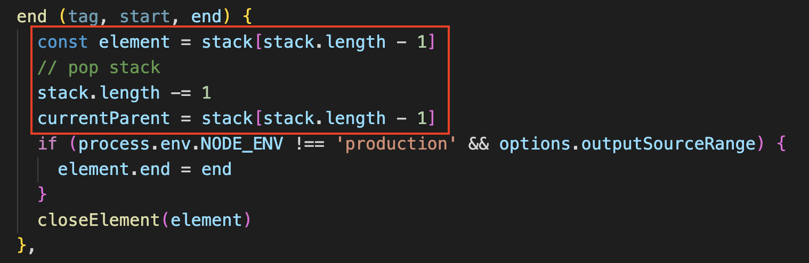

Vue.js 模板解析器原理
解析器要实现的功能是将模板解析成AST。

例如：

<div>
  <p>{{name}}</p>
</div>
上面的代码是一个比较简单的模板，它转换成AST后的样子如下：

{
  tag: "div"
  type: 1,
  staticRoot: false,
  static: false,
  plain: true,
  parent: undefined,
  attrsList: [],
  attrsMap: {},
  children: [
    {
      tag: "p"
      type: 1,
      staticRoot: false,
      static: false,
      plain: true,
      parent: {tag: "div", ...},
      attrsList: [],
      attrsMap: {},
      children: [{
        type: 2,
        text: "{{name}}",
        static: false,
        expression: "_s(name)"
      }]
    }
  ]
}
其实AST是用JS中的对象来描述一个节点，一个对象代表一个节点，对象中的属性用来保存节点所需的各种数据。比如:
parent属性保存了父节点的描述对象，
children属性是一个数组，里面保存了一些子节点的描述对象。
type属性代表一个节点的类型等。当很多个独立的节点通过parent属性和children属性连在一起时，就变成了一个树，而这样一个用对象描述的节点树其实就是AST。

解析器内部运行原理
事实上，解析器内部也分了好几个子解析器，比如HTML解析器、文本解析器以及过滤器解析器，其中最主要的是HTML解析器。顾名思义，HTML解析器的作用是解析HTML，它在解析HTML的过程中会不断触发各种钩子函数。这些钩子函数包括开始标签钩子函数、结束标签钩子函数、文本钩子函数以及注释钩子函数。

伪代码如下：
``` javascript
parseHTML(template, {
    start (tag, attrs, unary) {
        // 每当解析到标签的开始位置时，触发该函数
        // tag、attrs和unary，它们分别代表标签名、标签的属性以及是否是自闭合标签。
        let element = createASTElement(tag, attrs, currentParent)
    },
    end () {
        // 每当解析到标签的结束位置时，触发该函数
    },
    chars (text) {
        // 每当解析到文本时，触发该函数
        let element = {type: 3, text}
    },
    comment (text) {
        // 每当解析到注释时，触发该函数
        let element = {type: 3, text, isComment: true}
    }
})
function createASTElement (tag, attrs, parent) {
    return {
        type: 1,
        tag,
        attrsList: attrs,
        parent,
        children: []
    }
}
```
你可能不能很清晰地理解，下面我们举个简单的例子：

<div><p>我是LYF</p></div>
当上面这个模板被HTML解析器解析时，所触发的钩子函数依次是：start、start、chars、end。<br/>
也就是说，解析器其实是从前向后解析的。<br/>
解析到<div>时，会触发一个标签开始的钩子函数start；<br/>
然后解析到<p>时，又触发一次钩子函数start；<br/>
接着解析到 我是LYF 这行文本，此时触发了文本钩子函数chars；<br/>
然后解析到</p>，触发了标签结束的钩子函数end；<br/>
接着继续解析到</div>，此时又触发一次标签结束的钩子函数end，解析结束。<br/>

因此，我们可以在钩子函数中构建AST节点。在start钩子函数中构建元素类型的节点，在chars钩子函数中构建文本类型的节点，在comment钩子函数中构建注释类型的节点。

当HTML解析器不再触发钩子函数时，就代表所有模板都解析完毕，所有类型的节点都在钩子函数中构建完成，即AST构建完成。

我们发现，钩子函数start有三个参数，分别是
而文本节点的钩子函数chars和注释节点的钩子函数comment都只有一个参数，只有text。这是因为构建元素节点时需要知道标签名、属性和自闭合标识，而构建注释节点和文本节点时只需要知道文本即可。

在start钩子函数中，我们可以使用这三个参数来构建一个元素类型的AST节点，例如：
伪代码
``` javascript


parseHTML(template, {
})
```
如何构建AST层级关系。需要维护一个栈（stack）即可，用栈来记录层级关系，这个层级关系也可以理解为DOM的深度。

HTML解析器在解析HTML时，是从前向后解析。每当遇到开始标签，就触发钩子函数start。每当遇到结束标签，就会触发钩子函数end。

基于HTML解析器的逻辑，我们可以在每次触发钩子函数start时，把当前构建的节点推入栈中；每当触发钩子函数end时，就从栈中弹出一个节点（实际的源码中并没有出栈，而是通过来控制栈的长度来进行的）。
这样就可以保证每当触发钩子函数start时，栈的最后一个节点就是当前正在构建的节点的父节点


下面我们用一个具体的例子来描述如何从无到有构建一个带层级关系的AST。

假设有这样一个模板：

<div>
    <h1>我是LYF</h1>
    <p>我今年18岁</p>
</div>
上面这个模板被解析成AST的过程如图9-2所示。

构建AST的过程，具体如下。

(1) 模板的开始位置是div的开始标签，于是会触发钩子函数start。start触发后，会先构建一个div节点。此时发现栈是空的，这说明div节点是根节点，因为它没有父节点。最后，将div节点推入栈中，并将模板字符串中的div开始标签从模板中截取掉。

(2) 这时模板的开始位置是一些空格，这些空格会触发文本节点的钩子函数，在钩子函数里会忽略这些空格。同时会在模板中将这些空格截取掉。

(3) 这时模板的开始位置是h1的开始标签，于是会触发钩子函数start。与前面流程一样，start触发后，会先构建一个h1节点。此时发现栈的最后一个节点是div节点，这说明h1节点的父节点是div，于是将h1添加到div的子节点中，并且将h1节点推入栈中，同时从模板中将h1的开始标签截取掉。

(4) 这时模板的开始位置是一段文本，于是会触发钩子函数chars。chars触发后，会先构建一个文本节点，此时发现栈中的最后一个节点是h1，这说明文本节点的父节点是h1，于是将文本节点添加到h1节点的子节点中。由于文本节点没有子节点，所以文本节点不会被推入栈中。最后，将文本从模板中截取掉。

(5) 这时模板的开始位置是h1结束标签，于是会触发钩子函数end。end触发后，会把栈中最后一个节点弹出来。

(6) 与第(2)步一样，这时模板的开始位置是一些空格，这些空格会触发文本节点的钩子函数，在钩子函数里会忽略这些空格。同时会在模板中将这些空格截取掉。

(7) 这时模板的开始位置是p开始标签，于是会触发钩子函数start。start触发后，会先构建一个p节点。由于第(5)步已经从栈中弹出了一个节点，所以此时栈中的最后一个节点是div，这说明p节点的父节点是div。于是将p推入div的子节点中，最后将p推入到栈中，并将p的开始标签从模板中截取掉。

(8) 这时模板的开始位置又是一段文本，于是会触发钩子函数chars。当chars触发后，会先构建一个文本节点，此时发现栈中的最后一个节点是p节点，这说明文本节点的父节点是p节点。于是将文本节点推入p节点的子节点中，并将文本从模板中截取掉。

(9) 这时模板的开始位置是p的结束标签，于是会触发钩子函数end。当end触发后，会从栈中弹出一个节点出来，也就是把p标签从栈中弹出来，并将p的结束标签从模板中截取掉。

(10) 与第(2)步和第(6)步一样，这时模板的开始位置是一些空格，这些空格会触发文本节点的钩子函数并且在钩子函数里会忽略这些空格。同时会在模板中将这些空格截取掉。

(11) 这时模板的开始位置是div的结束标签，于是会触发钩子函数end。其逻辑与之前一样，把栈中的最后一个节点弹出来，也就是把div弹了出来，并将div的结束标签从模板中截取掉。

(12)这时模板已经被截取空了，也就代表着HTML解析器已经运行完毕。这时我们会发现栈已经空了，但是我们得到了一个完整的带层级关系的AST语法树。这个AST中清晰写明了每个节点的父节点、子节点及其节点类型。

9.3 HTML解析器
通过前面的介绍，我们发现构建AST非常依赖HTML解析器所执行的钩子函数以及钩子函数中所提供的参数，你一定会非常好奇HTML解析器是如何解析模板的，接下来我们会详细介绍HTML解析器的运行原理。

9.3.1 运行原理
事实上，解析HTML模板的过程就是循环的过程，简单来说就是用HTML模板字符串来循环，每轮循环都从HTML模板中通过正则匹配截取一小段字符串，然后重复以上过程，直到HTML模板被截成一个空字符串时结束循环，解析完毕，如图9-2所示。

在截取一小段字符串时，有可能截取到开始标签，也有可能截取到结束标签，又或者是文本或者注释，我们可以根据截取的字符串的类型来触发不同的钩子函数。

循环HTML模板的伪代码如下：

function parseHTML(html, options) {
  while (html) {
    // 截取模板字符串并触发钩子函数
  }
}
为了方便理解，我们手动模拟HTML解析器的解析过程。例如，下面这样一个简单的HTML模板：

<div>
  <p>{{name}}</p>
</div>
它在被HTML解析器解析的过程如下。

最初的HTML模板：

`<div>
  <p>{{name}}</p>
</div>`
第一轮循环时，截取出一段字符串<div>，并且触发钩子函数start，截取后的结果为：

`
  <p>{{name}}</p>
</div>`
第二轮循环时，截取出一段字符串：

`
  `
并且触发钩子函数chars，截取后的结果为：

`<p>{{name}}</p>
</div>`
第三轮循环时，截取出一段字符串<p>，并且触发钩子函数start，截取后的结果为：

`{{name}}</p>
</div>`
第四轮循环时，截取出一段字符串{{name}}，并且触发钩子函数chars，截取后的结果为：

`</p>
</div>`
第五轮循环时，截取出一段字符串</p>，并且触发钩子函数end，截取后的结果为：

`
</div>`
第六轮循环时，截取出一段字符串：

`
`
并且触发钩子函数chars，截取后的结果为：

`</div>`
第七轮循环时，截取出一段字符串</div>，并且触发钩子函数end，截取后的结果为：

``
解析完毕。

HTML解析器的全部逻辑都是在循环中执行，循环结束就代表解析结束。接下来，我们要讨论的重点是HTML解析器在循环中都干了些什么事。

你会发现HTML解析器可以很聪明地知道它在每一轮循环中应该截取哪些字符串，那么它是如何做到这一点的呢？

通过前面的例子，我们发现一个很有趣的事，那就是每一轮截取字符串时，都是在整个模板的开始位置截取。我们根据模板开始位置的片段类型，进行不同的截取操作。

例如，上面例子中的第一轮循环：如果是以开始标签开头的模板，就把开始标签截取掉。

再例如，上面例子中的第四轮循环：如果是以文本开始的模板，就把文本截取掉。

这些被截取的片段分很多种类型，示例如下。

开始标签，例如<div>。
结束标签，例如</div>。
HTML注释，例如<!-- 我是注释 -->。
DOCTYPE，例如<!DOCTYPE html>。
条件注释，例如<!--[if !IE]>-->我是注释<!--<![endif]-->。
文本，例如 我是LYF。
通常，最常见的是开始标签、结束标签、文本以及注释。

9.3.2 截取开始标签
上一节中我们说过，每一轮循环都是从模板的最前面截取，所以只有模板以开始标签开头，才需要进行开始标签的截取操作。

那么，如何确定模板是不是以开始标签开头？

在HTML解析器中，想分辨出模板是否以开始标签开头并不难，我们需要先判断HTML模板是不是以<开头。

如果HTML模板的第一个字符不是<，那么它一定不是以开始标签开头的模板，所以不需要进行开始标签的截取操作。

如果HTML模板以<开头，那么说明它至少是一个以标签开头的模板，但这个标签到底是什么类型的标签，还需要进一步确认。

如果模板以<开头，那么它有可能是以开始标签开头的模板，同时它也有可能是以结束标签开头的模板，还有可能是注释等其他标签，因为这些类型的片段都以<开头。那么，要进一步确定模板是不是以开始标签开头，还需要借助正则表达式来分辨模板的开始位置是否符合开始标签的特征。

那么，如何使用正则表达式来匹配模板以开始标签开头？我们看下面的代码：

const ncname = '[a-zA-Z_][\\w\\-\\.]*'
const qnameCapture = `((?:${ncname}\\:)?${ncname})`
const startTagOpen = new RegExp(`^<${qnameCapture}`)

// 以开始标签开始的模板
'<div></div>'.match(startTagOpen) // ["<div", "div", index: 0, input: "<div></div>"]

// 以结束标签开始的模板
'</div><div>我是Berwin</div>'.match(startTagOpen) // null

// 以文本开始的模板
'我是Berwin</p>'.match(startTagOpen) // null
通过上面的例子可以看到，只有'<div></div>'可以成功匹配，而以</div>开头的或者以文本开头的模板都无法成功匹配。

当HTML解析器解析到标签开始时，会触发钩子函数start，同时会给出三个参数，分别是标签名（tagName）、属性（attrs）以及自闭合标识（unary）。

因此，在分辨出模板以开始标签开始之后，需要将标签名、属性以及自闭合标识解析出来。

在分辨模板是否以开始标签开始时，就可以得到标签名，而属性和自闭合标识则需要进一步解析。

当完成上面的解析后，我们可以得到这样一个数据结构：

const start = '<div></div>'.match(startTagOpen)
if (start) {
    const match = {
        tagName: start[1],
        attrs: []
    }
}
这里有一个细节很重要：在前面的例子中，我们匹配到的开始标签并不全。例如：

const ncname = '[a-zA-Z_][\\w\\-\\.]*'
const qnameCapture = `((?:${ncname}\\:)?${ncname})`
const startTagOpen = new RegExp(`^<${qnameCapture}`)

'<div></div>'.match(startTagOpen)
// ["<div", "div", index: 0, input: "<div></div>"]

'<p></p>'.match(startTagOpen)
// ["<p", "p", index: 0, input: "<p></p>"]

'<div class="box"></div>'.match(startTagOpen)
// ["<div", "div", index: 0, input: "<div class="box"></div>"]
可以看出，上面这个正则表达式虽然可以分辨出模板是否以开始标签开头，但是它的匹配规则并不是匹配整个开始标签，而是开始标签的一小部分。

事实上，开始标签被拆分成三个小部分，分别是标签名、属性和结尾，如图9-3所示。

开始标签的三个小部分
图9-3 开始标签被拆分成三个小部分（代码用代码体）

通过“标签名”这一段字符，就可以分辨出模板是否以开始标签开头，此后要想得到属性和自闭合标识，则需要进一步解析。

1. 解析标签属性
在分辨模板是否以开始标签开头时，会将开始标签中的标签名这一小部分截取掉，因此在解析标签属性时，我们得到的模板是下面伪代码中的样子：

' class="box"></div>'
通常，标签属性是可选的，一个标签的属性有可能存在，也有可能不存在，所以需要判断标签是否存在属性，如果存在，对它进行截取。

下面的伪代码展示了如何解析开始标签中的属性，但是它只能解析一个属性：

const attribute = /^\s*([^\s"'<>\/=]+)(?:\s*(=)\s*(?:"([^"]*)"+|'([^']*)'+|([^\s"'=<>`]+)))?/
let html = ' class="box"></div>'
let attr = html.match(attribute)
html = html.substring(attr[0].length)
console.log(attr)
// [' class="box"', 'class', '=', 'box', undefined, undefined, index: 0, input: ' class="box"></div>']
如果标签上有很多属性，那么上面的处理方式就不足以支撑解析任务的正常运行。例如下面的代码：

const attribute = /^\s*([^\s"'<>\/=]+)(?:\s*(=)\s*(?:"([^"]*)"+|'([^']*)'+|([^\s"'=<>`]+)))?/
let html = ' class="box" id="el"></div>'
let attr = html.match(attribute)
html = html.substring(attr[0].length)
console.log(attr)
// [' class="box"', 'class', '=', 'box', undefined, undefined, index: 0, input: ' class="box" id="el"></div>']
可以看到，这里只解析出了class属性，而id属性没有解析出来。

此时剩余的HTML模板是这样的：

' id="el"></div>'
所以属性也可以分成多个小部分，一小部分一小部分去解析与截取。

解决这个问题时，我们只需要每解析一个属性就截取一个属性。如果截取完后，剩下的HTML模板依然符合标签属性的正则表达式，那么说明还有剩余的属性需要处理，此时就重复执行前面的流程，直到剩余的模板不存在属性，也就是剩余的模板不存在符合正则表达式所预设的规则。

例如：

const startTagClose = /^\s*(\/?)>/
const attribute = /^\s*([^\s"'<>\/=]+)(?:\s*(=)\s*(?:"([^"]*)"+|'([^']*)'+|([^\s"'=<>`]+)))?/
let html = ' class="box" id="el"></div>'
let end, attr
const match = {tagName: 'div', attrs: []}

while (!(end = html.match(startTagClose)) && (attr = html.match(attribute))) {
    html = html.substring(attr[0].length)
    match.attrs.push(attr)
}
上面这段代码的意思是，如果剩余HTML模板不符合开始标签结尾部分的特征，并且符合标签属性的特征，那么进入到循环中进行解析与截取操作。

通过match方法解析出的结果为：

{
    tagName: 'div',
    attrs: [
        [' class="box"', 'class', '=', 'box', null, null],
        [' id="el"', 'id','=', 'el', null, null]
    ]
}
可以看到，标签中的两个属性都已经解析好并且保存在了attrs中。

此时剩余模板是下面的样子：

"></div>"
我们将属性解析后的模板与解析之前的模板进行对比：

// 解析前的模板
' class="box" id="el"></div>'

// 解析后的模板
'></div>'

// 解析前的数据
{
    tagName: 'div',
    attrs: []
}

// 解析后的数据
{
    tagName: 'div',
    attrs: [
        [' class="box"', 'class', '=', 'box', null, null],
        [' id="el"', 'id','=', 'el', null, null]
    ]
}
可以看到，标签上的所有属性都已经被成功解析出来，并保存在attrs属性中。

2. 解析自闭合标识
如果我们接着上面的例子继续解析的话，目前剩余的模板是下面这样的：

'></div>'
开始标签中结尾部分解析的主要目的是解析出当前这个标签是否是自闭合标签。

举个例子：

<div></div>
这样的div标签就不是自闭合标签，而下面这样的input标签就属于自闭合标签：

<input type="text" />
自闭合标签是没有子节点的，所以前文中我们提到构建AST层级时，需要维护一个栈，而一个节点是否需要推入到栈中，可以使用这个自闭合标识来判断。

那么，如何解析开始标签中的结尾部分呢？看下面这段代码：

function parseStartTagEnd (html) {
  const startTagClose = /^\s*(\/?)>/
  const end = html.match(startTagClose)
  const match = {}

  if (end) {
      match.unarySlash = end[1]
      html = html.substring(end[0].length)
      return match
  }
}

console.log(parseStartTagEnd('></div>')) // {unarySlash: ""}
console.log(parseStartTagEnd('/><div></div>')) // {unarySlash: "/"}
这段代码可以正确解析出开始标签是否是自闭合标签。

从代码中打印出来的结果可以看到，自闭合标签解析后的unarySlash属性为/，而非自闭合标签为空字符串。

3. 实现源码
前面解析开始标签时，我们将其拆解成了三个部分，分别是标签名、属性和结尾。我相信你已经对开始标签的解析有了一个清晰的认识，接下来看一下Vue.js中真实的代码是什么样的：

const ncname = '[a-zA-Z_][\\w\\-\\.]*'
const qnameCapture = `((?:${ncname}\\:)?${ncname})`
const startTagOpen = new RegExp(`^<${qnameCapture}`)
const startTagClose = /^\s*(\/?)>/

function advance (n) {
    html = html.substring(n)
}

function parseStartTag () {
    // 解析标签名，判断模板是否符合开始标签的特征
    const start = html.match(startTagOpen)
    if (start) {
        const match = {
            tagName: start[1],
            attrs: []
        }
        advance(start[0].length)
        
        // 解析标签属性
        let end, attr
        while (!(end = html.match(startTagClose)) && (attr = html.match(attribute))) {
            advance(attr[0].length)
            match.attrs.push(attr)
        }
        
        // 判断是否是自闭合标签
        if (end) {
            match.unarySlash = end[1]
            advance(end[0].length)
            return match
        }
    }
}
上面的代码是Vue.js中解析开始标签的源码，这段代码中的html变量是HTML模板。

调用parseStartTag就可以将剩余模板开始部分的开始标签解析出来。如果剩余HTML模板的开始部分不符合开始标签的正则表达式规则，那么调用parseStartTag就会返回undefined。因此，判断剩余模板是否符合开始标签的规则，只需要调用parseStartTag即可。如果调用它后得到了解析结果，那么说明剩余模板的开始部分符合开始标签的规则，此时将解析出来的结果取出来并调用钩子函数start即可：

// 开始标签
const startTagMatch = parseStartTag()
if (startTagMatch) {
    handleStartTag(startTagMatch)
    continue
}
前面我们说过，所有解析操作都运行在循环中，所以continue的意思是这一轮的解析工作已经完成，可以进行下一轮解析工作。

从代码中可以看出，如果调用parseStartTag之后有返回值，那么会进行开始标签的处理，其处理逻辑主要在handleStartTag中。这个函数的主要目的就是将tagName、attrs和unary等数据取出来，然后调用钩子函数将这些数据放到参数中。

截取结束标签
结束标签的截取要比开始标签简单得多，因为它不需要解析什么，只需要分辨出当前是否已经截取到结束标签，如果是，那么触发钩子函数就可以了。

那么，如何分辨模板已经截取到结束标签了呢？其道理其实和开始标签的截取相同。

如果HTML模板的第一个字符不是<，那么一定不是结束标签。只有HTML模板的第一个字符是<时，我们才需要进一步确认它到底是不是结束标签。

进一步确认时，我们只需要判断剩余HTML模板的开始位置是否符合正则表达式中定义的规则即可：

const ncname = '[a-zA-Z_][\\w\\-\\.]*'
const qnameCapture = `((?:${ncname}\\:)?${ncname})`
const endTag = new RegExp(`^<\\/${qnameCapture}[^>]*>`)

const endTagMatch = '</div>'.match(endTag)
const endTagMatch2 = '<div>'.match(endTag)

console.log(endTagMatch) // ["</div>", "div", index: 0, input: "</div>"]
console.log(endTagMatch2) // null
上面代码可以分辨出剩余模板是否是结束标签。当分辨出结束标签后，需要做两件事，一件事是截取模板，另一件事是触发钩子函数。而Vue.js中相关源码被精简后如下：

const endTagMatch = html.match(endTag)
if (endTagMatch) {
    html = html.substring(endTagMatch[0].length)
    options.end(endTagMatch[1])
    continue
}
可以看出，先对模板进行截取，然后触发钩子函数。

截取注释
分辨模板是否已经截取到注释的原理与开始标签和结束标签相同，先判断剩余HTML模板的第一个字符是不是<，如果是，再用正则表达式来进一步匹配：

const comment = /^<!--/

if (comment.test(html)) {
    const commentEnd = html.indexOf('-->')

    if (commentEnd >= 0) {
        if (options.shouldKeepComment) {
            options.comment(html.substring(4, commentEnd))
        }
        html = html.substring(commentEnd + 3)
        continue
    }
}
在上面的代码中，我们使用正则表达式来判断剩余的模板是否符合注释的规则，如果符合，就将这段注释文本截取出来。

这里有一个有意思的地方，那就是注释的钩子函数可以通过选项来配置，只有options.shouldKeepComment为真时，才会触发钩子函数，否则只截取模板，不触发钩子函数。

9.3.5 截取条件注释
条件注释不需要触发钩子函数，我们只需要把它截取掉就行了。

截取条件注释的原理与截取注释非常相似，如果模板的第一个字符是<，并且符合我们事先用正则表达式定义好的规则，就说明需要进行条件注释的截取操作。

在下面的代码中，我们通过indexOf找到条件注释结束位置的下标，然后将结束位置前的字符都截取掉：

const conditionalComment = /^<!\[/
if (conditionalComment.test(html)) {
    const conditionalEnd = html.indexOf(']>')

    if (conditionalEnd >= 0) {
        html = html.substring(conditionalEnd + 2)
        continue
    }
}
我们来举个例子：

const conditionalComment = /^<!\[/
let html = '<![if !IE]><link href="non-ie.css" rel="stylesheet"><![endif]>'
if (conditionalComment.test(html)) {
    const conditionalEnd = html.indexOf(']>')
    if (conditionalEnd >= 0) {
        html = html.substring(conditionalEnd + 2)
    }
}

console.log(html) // '<link href="non-ie.css" rel="stylesheet"><![endif]>'
从打印结果中可以看到，HTML中的条件注释部分截取掉了。

通过这个逻辑可以发现，在Vue.js中条件注释其实没有用，写了也会被截取掉，通俗一点说就是写了也白写。

截取DOCTYPE
DOCTYPE与条件注释相同，都是不需要触发钩子函数的，只需要将匹配到的这一段字符截取掉即可。下面的代码将DOCTYPE这段字符匹配出来后，根据它的length属性来决定要截取多长的字符串：

const doctype = /^<!DOCTYPE [^>]+>/i
const doctypeMatch = html.match(doctype)
if (doctypeMatch) {
    html = html.substring(doctypeMatch[0].length)
    continue
}
示例如下：

const doctype = /^<!DOCTYPE [^>]+>/i
let html = '<!DOCTYPE html><html lang="en"><head></head><body></body></html>'
const doctypeMatch = html.match(doctype)
if (doctypeMatch) {
    html = html.substring(doctypeMatch[0].length)
}

console.log(html) // '<html lang="en"><head></head><body></body></html>'
从打印结果可以看到，HTML中的DOCTYPE被成功截取掉了。

截取文本
若想分辨在本轮循环中HTML模板是否已经截取到文本，其实很简单，我们甚至不需要使用正则表达式。

在前面的其他标签类型中，我们都会判断剩余HTML模板的第一个字符是否是<，如果是，再进一步确认到底是哪种类型。这是因为以<开头的标签类型太多了，如开始标签、结束标签和注释等。然而文本只有一种，如果HTML模板的第一个字符不是<，那么它一定是文本了。

例如：

我是文本</div>
上面这段HTML模板并不是以<开头的，所以可以断定它是以文本开头的。

那么，如何从模板中将文本解析出来呢？我们只需要找到下一个<在什么位置，这之前的所有字符都属于文本，如图9-4所示。

尖括号前面的字符都属于文本
图9-4 尖括号前面的字符都属于文本

在代码中可以这样实现：

while (html) {
    let text
    let textEnd = html.indexOf('<')
    
    // 截取文本
    if (textEnd >= 0) {
        text = html.substring(0, textEnd)
        html = html.substring(textEnd)
    }

    // 如果模板中找不到<，就说明整个模板都是文本
    if (textEnd < 0) {
        text = html
        html = ''
    }

    // 触发钩子函数
    if (options.chars && text) {
        options.chars(text)
    }
}
上面的代码共有三部分逻辑。

第一部分是截取文本，这在前面介绍过了。<之前的所有字符都是文本，直接使用html.substring从模板的最开始位置截取到<之前的位置，就可以将文本截取出来。

第二部分是一个条件：如果在整个模板中都找不到<，那么说明整个模板全是文本。

第三部分是触发钩子函数并将截取出来的文本放到参数中。

关于文本，还有一个特殊情况需要处理：如果<是文本的一部分，该如何处理？

举个例子：

1<2</div>
在上面这样的模板中，如果只截取第一个<前面的字符，最后被截取出来的将只有1，而不能把所有文本都截取出来。

那么，该如何解决这个问题呢？

有一个思路是，如果将<前面的字符截取完之后，剩余的模板不符合任何需要被解析的片段的类型，就说明这个<是文本的一部分。

什么是需要被解析的片段的类型？在9.3.1节中，我们说过HTML解析器是一段一段截取模板的，而被截取的每一段都符合某种类型，这些类型包括开始标签、结束标签和注释等。

说的再具体一点，那就是上面这段代码中的1被截取完之后，剩余模板是下面的样子：

<2</div>
<2符合开始标签的特征么？不符合。

<2符合结束标签的特征么？不符合。

<2符合注释的特征么？不符合。

当剩余的模板什么都不符合时，就说明<属于文本的一部分。

当判断出<是属于文本的一部分后，我们需要做的事情是找到下一个<并将其前面的文本截取出来加到前面截取了一半的文本后面。

这里还用上面的例子，第二个<之前的字符是<2，那么把<2截取出来后，追加到上一次截取出来的1的后面，此时的结果是：

1<2
截取后剩余的模板是：

</div>
如果剩余的模板依然不符合任何被解析的类型，那么重复此过程。直到所有文本都解析完。

说完了思路，我们看一下具体的实现，伪代码如下：

while (html) {
    let text, rest, next
    let textEnd = html.indexOf('<')
    
    // 截取文本
    if (textEnd >= 0) {
        rest = html.slice(textEnd)
        while (
            !endTag.test(rest) &&
            !startTagOpen.test(rest) &&
            !comment.test(rest) &&
            !conditionalComment.test(rest)
        ) {
            // 如果'<'在纯文本中，将它视为纯文本对待
            next = rest.indexOf('<', 1)
            if (next < 0) break
            textEnd += next
            rest = html.slice(textEnd)
        }
        text = html.substring(0, textEnd)
        html = html.substring(textEnd)
    }
    
    // 如果模板中找不到<，那么说明整个模板都是文本
    if (textEnd < 0) {
        text = html
        html = ''
    }
    
    // 触发钩子函数
    if (options.chars && text) {
        options.chars(text)
    }
}
在代码中，我们通过while来解决这个问题（注意是里面的while）。如果剩余的模板不符合任何被解析的类型，那么重复解析文本，直到剩余模板符合被解析的类型为止。

在上面的代码中，endTag、startTagOpen、comment和conditionalComment都是正则表达式，分别匹配结束标签、开始标签、注释和条件注释。

在Vue.js源码中，截取文本的逻辑和其他的实现思路一致。

纯文本内容元素的处理
什么是纯文本内容元素呢？script、style和textarea这三种元素叫作纯文本内容元素。解析它们的时候，会把这三种标签内包含的所有内容都当作文本处理。那么，具体该如何处理呢？

前面介绍开始标签、结束标签、文本、注释的截取时，其实都是默认当前需要截取的元素的父级元素不是纯文本内容元素。事实上，如果要截取元素的父级元素是纯文本内容元素的话，处理逻辑将完全不一样。

事实上，在while循环中，最外层的判断条件就是父级元素是不是纯文本内容元素。例如下面的伪代码：

while (html) {
    if (!lastTag || !isPlainTextElement(lastTag)) {
        // 父元素为正常元素的处理逻辑
    } else {
        // 父元素为script、style、textarea的处理逻辑
    }
}
在上面的代码中，lastTag代表父元素。可以看到，在while中，首先进行判断，如果父元素不存在或者不是纯文本内容元素，那么进行正常的处理逻辑，也就是前面介绍的逻辑。

而当父元素是script这种纯文本内容元素时，会进入到else这个语句里面。由于纯文本内容元素都被视作文本处理，所以我们的处理逻辑就变得很简单，只需要把这些文本截取出来并触发钩子函数chars，然后再将结束标签截取出来并触发钩子函数end。

也就是说，如果父标签是纯文本内容元素，那么本轮循环会一次性将这个父标签给处理完毕。

伪代码如下：

while (html) {
    if (!lastTag || !isPlainTextElement(lastTag)) {
        // 父元素为正常元素的处理逻辑
    } else {
        // 父元素为script、style、textarea的处理逻辑
        const stackedTag = lastTag.toLowerCase()
        const reStackedTag = reCache[stackedTag] || (reCache[stackedTag] = new RegExp('([\\s\\S]*?)(</' + stackedTag + '[^>]*>)', 'i'))
        const rest = html.replace(reStackedTag, function (all, text) {
            if (options.chars) {
                options.chars(text)
            }
            return ''
        })
        html = rest
        options.end(stackedTag)
    }
}
上面代码中的正则表达式可以匹配结束标签前包括结束标签自身在内的所有文本。

我们可以给replace方法的第二个参数传递一个函数。在这个函数中，我们得到了参数text（代表结束标签前的所有内容），触发了钩子函数chars并把text放到钩子函数的参数中传出去。最后，返回了一个空字符串，代表将匹配到的内容都截掉了。注意，这里的截掉会将内容和结束标签一起截取掉。

最后，调用钩子函数end并将标签名放到参数中传出去，代表本轮循环中的所有逻辑都已处理完毕。

假如我们现在有这样一个模板：

<div id="el">
    <script>console.log(1)</script>
</div>
当解析到script中的内容时，模板是下面的样子：

console.log(1)</script>
</div>
此时父元素为script，所以会进入到else中的逻辑进行处理。在其处理过程中，会触发钩子函数chars和end。

钩子函数chars的参数为script中的所有内容，本例中大概是下面的样子：

chars('console.log(1)')
钩子函数end的参数为标签名，本例中是script。

处理后的剩余模板如下：

</div>
使用栈维护DOM层级
通过前面几节的介绍，特别是9.3.8节中的介绍，你一定会感到很奇怪，如何知道父元素是谁？

在前面几节中，我们并没有介绍HTML解析器内部其实也有一个栈来维护DOM层级关系，其逻辑与9.2.1节相同：就是每解析到开始标签，就向栈中推进去一个；每解析到标签结束，就弹出来一个。因此，想取到父元素并不难，只需要拿到栈中的最后一项即可。

同时，HTML解析器中的栈还有另一个作用，它可以检测出HTML标签是否正确闭合。例如：

<div><p></div>
在上面的代码中，p标签忘记写结束标签，那么当HTML解析器解析到div的结束标签时，栈顶的元素却是p标签。这个时候从栈顶向栈底循环找到div标签，在找到div标签之前遇到的所有其他标签都是忘记了闭合的标签，而Vue.js会在非生产环境下在控制台打印警告提示。


整体逻辑
前面我们把开始标签、结束标签、注释、文本、纯文本内容元素等的截取方式拆分开，单独进行了详细介绍。本节中，我们就来介绍如何将这些解析方式组装起来完成HTML解析器的功能。

首先，HTML解析器是一个函数。就像9.2节介绍的那样，HTML解析器最终的目的是实现这样的功能：

parseHTML(template, {
    start (tag, attrs, unary) {
        // 每当解析到标签的开始位置时，触发该函数
    },
    end () {
        // 每当解析到标签的结束位置时，触发该函数
    },
    chars (text) {
        // 每当解析到文本时，触发该函数
    },
    comment (text) {
        // 每当解析到注释时，触发该函数
    }
})
所以HTML解析器在实现上肯定是一个函数，它有两个参数——模板和选项：

export function parseHTML (html, options) {
    // 做点什么
}
我们的模板是一小段一小段去截取与解析的，所以需要一个循环来不断截取，直到全部截取完毕：

export function parseHTML (html, options) {
    while (html) {
        // 做点什么
    }
}
在循环中，首先要判断父元素是不是纯文本内容元素，因为不同类型父节点的解析方式将完全不同：

export function parseHTML (html, options) {
    while (html) {
        if (!lastTag || !isPlainTextElement(lastTag)) {
            // 父元素为正常元素的处理逻辑
        } else {
            // 父元素为script、style、textarea的处理逻辑
        }
    }
}
在上面的代码中，我们发现这里已经把整体逻辑分成了两部分，一部分是父标签是正常标签的逻辑，另一部分是父标签是script、style、textarea这种纯文本内容元素的逻辑。

如果父标签为正常的元素，那么有几种情况需要分别处理，比如需要分辨出当前要解析的一小段模板到底是什么类型。是开始标签？还是结束标签？又或者是文本？

我们把所有需要处理的情况都列出来，有下面几种情况：

文本
注释
条件注释
DOCTYPE
结束标签
开始标签
我们会发现，在这些需要处理的类型中，除了文本之外，其他都是以标签形式存在的，而标签是以<开头的。

所以逻辑就很清晰了，我们先根据<来判断需要解析的字符是文本还是其他的：

export function parseHTML (html, options) {
    while (html) {
        if (!lastTag || !isPlainTextElement(lastTag)) {
            let textEnd = html.indexOf('<')
            if (textEnd === 0) {
                // 做点什么
            }
            
            let text, rest, next
            if (textEnd >= 0) {
                // 解析文本
            }
            
            if (textEnd < 0) {
                text = html
                html = ''
            }
            
            if (options.chars && text) {
                options.chars(text)
            }
        } else {
            // 父元素为script、style、textarea的处理逻辑
        }
    }
}
在上面的代码中，我们可以通过<来分辨是否需要进行文本解析。

如果通过<分辨出即将解析的这一小部分字符不是文本而是标签类，那么标签类有那么多类型，我们需要进一步分辨具体是哪种类型：

export function parseHTML (html, options) {
    while (html) {
        if (!lastTag || !isPlainTextElement(lastTag)) {
            let textEnd = html.indexOf('<')
            if (textEnd === 0) {
                // 注释
                if (comment.test(html)) {
                    // 注释的处理逻辑
                    continue
                }
                
                // 条件注释
                if (conditionalComment.test(html)) {
                    // 条件注释的处理逻辑
                    continue
                }
                
                // DOCTYPE
                const doctypeMatch = html.match(doctype)
                if (doctypeMatch) {
                    // DOCTYPE的处理逻辑
                    continue
                }
                
                // 结束标签
                const endTagMatch = html.match(endTag)
                if (endTagMatch) {
                    // 结束标签的处理逻辑
                    continue
                }
                
                // 开始标签
                const startTagMatch = parseStartTag()
                if (startTagMatch) {
                    // 开始标签的处理逻辑
                    continue
                }
            }
            
            let text, rest, next
            if (textEnd >= 0) {
                // 解析文本
            }
            
            if (textEnd < 0) {
                text = html
                html = ''
            }
            
            if (options.chars && text) {
                options.chars(text)
            }
        } else {
            // 父元素为script、style、textarea的处理逻辑
        }
    }
}
关于不同类型的具体处理方式，前面已经详细介绍过，这里不再重复。

文本解析器
文本解析器的作用是解析文本。你可能会觉得很奇怪，文本不是在HTML解析器中被解析出来了么？准确地说，文本解析器是对HTML解析器解析出来的文本进行二次加工。为什么要进行二次加工？

文本其实分两种类型，一种是纯文本，另一种是带变量的文本。例如下面这样的文本是纯文本：

Hello LYF
而下面这样的是带变量的文本：

Hello {{name}}
在Vue.js模板中，我们可以使用变量来填充模板。而HTML解析器在解析文本时，并不会区分文本是否是带变量的文本。如果是纯文本，不需要进行任何处理；但如果是带变量的文本，那么需要使用文本解析器进一步解析。因为带变量的文本在使用虚拟DOM进行渲染时，需要将变量替换成变量中的值。

每当HTML解析器解析到文本时，都会触发chars函数，并且从参数中得到解析出的文本。在chars函数中，我们需要构建文本类型的AST，并将它添加到父节点的children属性中。

而在构建文本类型的AST时，纯文本和带变量的文本是不同的处理方式。如果是带变量的文本，我们需要借助文本解析器对它进行二次加工，其代码如下：

parseHTML(template, {
    start (tag, attrs, unary) {
        // 每当解析到标签的开始位置时，触发该函数
    },
    end () {
        // 每当解析到标签的结束位置时，触发该函数
    },
    chars (text) {
        text = text.trim()
        if (text) {
            const children = currentParent.children
            let expression
            if (expression = parseText(text)) {
                children.push({
                    type: 2,
                    expression,
                    text
                })
            } else {
                children.push({
                    type: 3,
                    text
                })
            }
        }
    },
    comment (text) {
        // 每当解析到注释时，触发该函数
    }
})
在chars函数中，如果执行parseText后有返回结果，则说明文本是带变量的文本，并且已经通过文本解析器（parseText）二次加工，此时构建一个带变量的文本类型的AST并将其添加到父节点的children属性中。否则，就直接构建一个普通的文本节点并将其添加到父节点的children属性中。而代码中的currentParent是当前节点的父节点，也就是前面介绍的栈中的最后一个节点。

假设chars函数被触发后，我们得到的text是一个带变量的文本：

"Hello {{name}}"
这个带变量的文本被文本解析器解析之后，得到的expression变量是这样的：

"Hello "+_s(name)
上面代码中的_s其实是下面这个toString函数的别名：

function toString (val) {
    return val == null
        ? ''
        : typeof val === 'object'
            ? JSON.stringify(val, null, 2)
            : String(val)
}
假设当前上下文中有一个变量name，其值为Berwin，那么expression中的内容被执行时，它的内容是不是就是Hello Berwin了？

我们举个例子：

var obj = {name: 'Berwin'}
with(obj) {
    function toString (val) {
        return val == null
            ? ''
            : typeof val === 'object'
                ? JSON.stringify(val, null, 2)
                : String(val)
    }
    console.log("Hello "+toString(name)) // "Hello Berwin"
}
在上面的代码中，我们打印出来的结果是"Hello Berwin"。

事实上，最终AST会转换成代码字符串放在with中执行，这部分内容会在第11章中详细介绍。

接着，我们详细介绍如何加工文本，也就是文本解析器的内部实现原理。

在文本解析器中，第一步要做的事情就是使用正则表达式来判断文本是否是带变量的文本，也就是检查文本中是否包含{{xxx}}这样的语法。如果是纯文本，则直接返回undefined；如果是带变量的文本，再进行二次加工。所以我们的代码是这样的：

function parseText (text) {
    const tagRE = /\{\{((?:.|\n)+?)\}\}/g
    if (!tagRE(text)) {
        return
    }
}
在上面的代码中，如果是纯文本，则直接返回。如果是带变量的文本，该如何处理呢？

一个解决思路是使用正则表达式匹配出文本中的变量，先把变量左边的文本添加到数组中，然后把变量改成_s(x)这样的形式也添加到数组中。如果变量后面还有变量，则重复以上动作，直到所有变量都添加到数组中。如果最后一个变量的后面有文本，就将它添加到数组中。

这时我们其实已经有一个数组，数组元素的顺序和文本的顺序是一致的，此时将这些数组元素用+连起来变成字符串，就可以得到最终想要的效果

文本解析过程
图9-5 文本解析过程

在图9-5中，最上面的字符串代表即将解析的文本，中间两个方块代表数组中的两个元素。最后，使用数组方法join将这两个元素合并成一个字符串。

具体实现代码如下：

function parseText (text) {
    const tagRE = /\{\{((?:.|\n)+?)\}\}/g
    if (!tagRE.test(text)) {
        return
    }

    const tokens = []
    let lastIndex = tagRE.lastIndex = 0
    let match, index
    while ((match = tagRE.exec(text))) {
        index = match.index
        // 先把 {{ 前边的文本添加到tokens中
        if (index > lastIndex) {
            tokens.push(JSON.stringify(text.slice(lastIndex, index)))
        }
        // 把变量改成`_s(x)`这样的形式也添加到数组中
        tokens.push(`_s(${match[1].trim()})`)
        
        // 设置lastIndex来保证下一轮循环时，正则表达式不再重复匹配已经解析过的文本
        lastIndex = index + match[0].length
    }
    
    // 当所有变量都处理完毕后，如果最后一个变量右边还有文本，就将文本添加到数组中
    if (lastIndex < text.length) {
        tokens.push(JSON.stringify(text.slice(lastIndex)))
    }
    return tokens.join('+')
}
这是文本解析器的全部代码，代码并不多，逻辑也不是很复杂。

这段代码有一个很关键的地方在lastIndex：每处理完一个变量后，会重新设置lastIndex的位置，这样可以保证如果后面还有其他变量，那么在下一轮循环时可以从lastIndex的位置开始向后匹配，而lastIndex之前的文本将不再被匹配。

下面用文本解析器解析不同的文本看看：

parseText('你好{{name}}')
// '"你好 "+_s(name)'

parseText('你好Berwin')
// undefined

parseText('你好{{name}}, 你今年已经{{age}}岁啦')
// '"你好"+_s(name)+", 你今年已经"+_s(age)+"岁啦"'
从上面代码的打印结果可以看到，文本已经被正确解析了。

9.5 总结
解析器的作用是通过模板得到AST（抽象语法树）。

生成AST的过程需要借助HTML解析器，当HTML解析器触发不同的钩子函数时，我们可以构建出不同的节点。

随后，我们可以通过栈来得到当前正在构建的节点的父节点，然后将构建出的节点添加到父节点的下面。

最终，当HTML解析器运行完毕后，我们就可以得到一个完整的带DOM层级关系的AST。

HTML解析器的内部原理是一小段一小段地截取模板字符串，每截取一小段字符串，就会根据截取出来的字符串类型触发不同的钩子函数，直到模板字符串截空停止运行。

文本分两种类型，不带变量的纯文本和带变量的文本，后者需要使用文本解析器进行二次加工。

vue.js 源码
``` javascript
/**
 * Not type-checking this file because it's mostly vendor code.
 */

/*!
 * HTML Parser By John Resig (ejohn.org)
 * Modified by Juriy "kangax" Zaytsev
 * Original code by Erik Arvidsson (MPL-1.1 OR Apache-2.0 OR GPL-2.0-or-later)
 * http://erik.eae.net/simplehtmlparser/simplehtmlparser.js
 */

import { makeMap, no } from 'shared/util'
import { isNonPhrasingTag } from 'web/compiler/util'
import { unicodeRegExp } from 'core/util/lang'

// Regular Expressions for parsing tags and attributes
const attribute = /^\s*([^\s"'<>\/=]+)(?:\s*(=)\s*(?:"([^"]*)"+|'([^']*)'+|([^\s"'=<>`]+)))?/
const dynamicArgAttribute = /^\s*((?:v-[\w-]+:|@|:|#)\[[^=]+\][^\s"'<>\/=]*)(?:\s*(=)\s*(?:"([^"]*)"+|'([^']*)'+|([^\s"'=<>`]+)))?/
const ncname = `[a-zA-Z_][\\-\\.0-9_a-zA-Z${unicodeRegExp.source}]*`
const qnameCapture = `((?:${ncname}\\:)?${ncname})`
const startTagOpen = new RegExp(`^<${qnameCapture}`)
const startTagClose = /^\s*(\/?)>/
const endTag = new RegExp(`^<\\/${qnameCapture}[^>]*>`)
const doctype = /^<!DOCTYPE [^>]+>/i
// #7298: escape - to avoid being passed as HTML comment when inlined in page
const comment = /^<!\--/
const conditionalComment = /^<!\[/

// Special Elements (can contain anything)
export const isPlainTextElement = makeMap('script,style,textarea', true)
const reCache = {}

const decodingMap = {
  '&lt;': '<',
  '&gt;': '>',
  '&quot;': '"',
  '&amp;': '&',
  '&#10;': '\n',
  '&#9;': '\t',
  '&#39;': "'"
}
const encodedAttr = /&(?:lt|gt|quot|amp|#39);/g
const encodedAttrWithNewLines = /&(?:lt|gt|quot|amp|#39|#10|#9);/g

// #5992
const isIgnoreNewlineTag = makeMap('pre,textarea', true)
const shouldIgnoreFirstNewline = (tag, html) => tag && isIgnoreNewlineTag(tag) && html[0] === '\n'

function decodeAttr (value, shouldDecodeNewlines) {
  const re = shouldDecodeNewlines ? encodedAttrWithNewLines : encodedAttr
  return value.replace(re, match => decodingMap[match])
}

export function parseHTML (html, options) {
  const stack = []
  const expectHTML = options.expectHTML
  const isUnaryTag = options.isUnaryTag || no
  const canBeLeftOpenTag = options.canBeLeftOpenTag || no
  let index = 0
  let last, lastTag
  while (html) {
    last = html
    // Make sure we're not in a plaintext content element like script/style
    if (!lastTag || !isPlainTextElement(lastTag)) {
      let textEnd = html.indexOf('<')
      if (textEnd === 0) {
        // Comment:
        if (comment.test(html)) {
          const commentEnd = html.indexOf('-->')

          if (commentEnd >= 0) {
            if (options.shouldKeepComment) {
              options.comment(html.substring(4, commentEnd), index, index + commentEnd + 3)
            }
            advance(commentEnd + 3)
            continue
          }
        }

        // http://en.wikipedia.org/wiki/Conditional_comment#Downlevel-revealed_conditional_comment
        if (conditionalComment.test(html)) {
          const conditionalEnd = html.indexOf(']>')

          if (conditionalEnd >= 0) {
            advance(conditionalEnd + 2)
            continue
          }
        }

        // Doctype:
        const doctypeMatch = html.match(doctype)
        if (doctypeMatch) {
          advance(doctypeMatch[0].length)
          continue
        }

        // End tag:
        const endTagMatch = html.match(endTag)
        if (endTagMatch) {
          const curIndex = index
          advance(endTagMatch[0].length)
          parseEndTag(endTagMatch[1], curIndex, index)
          continue
        }

        // Start tag:
        const startTagMatch = parseStartTag()
        if (startTagMatch) {
          handleStartTag(startTagMatch)
          if (shouldIgnoreFirstNewline(startTagMatch.tagName, html)) {
            advance(1)
          }
          continue
        }
      }

      let text, rest, next
      if (textEnd >= 0) {
        rest = html.slice(textEnd)
        while (
          !endTag.test(rest) &&
          !startTagOpen.test(rest) &&
          !comment.test(rest) &&
          !conditionalComment.test(rest)
        ) {
          // < in plain text, be forgiving and treat it as text
          next = rest.indexOf('<', 1)
          if (next < 0) break
          textEnd += next
          rest = html.slice(textEnd)
        }
        text = html.substring(0, textEnd)
      }

      if (textEnd < 0) {
        text = html
      }

      if (text) {
        advance(text.length)
      }

      if (options.chars && text) {
        options.chars(text, index - text.length, index)
      }
    } else {
      let endTagLength = 0
      const stackedTag = lastTag.toLowerCase()
      const reStackedTag = reCache[stackedTag] || (reCache[stackedTag] = new RegExp('([\\s\\S]*?)(</' + stackedTag + '[^>]*>)', 'i'))
      const rest = html.replace(reStackedTag, function (all, text, endTag) {
        endTagLength = endTag.length
        if (!isPlainTextElement(stackedTag) && stackedTag !== 'noscript') {
          text = text
            .replace(/<!\--([\s\S]*?)-->/g, '$1') // #7298
            .replace(/<!\[CDATA\[([\s\S]*?)]]>/g, '$1')
        }
        if (shouldIgnoreFirstNewline(stackedTag, text)) {
          text = text.slice(1)
        }
        if (options.chars) {
          options.chars(text)
        }
        return ''
      })
      index += html.length - rest.length
      html = rest
      parseEndTag(stackedTag, index - endTagLength, index)
    }

    if (html === last) {
      options.chars && options.chars(html)
      if (process.env.NODE_ENV !== 'production' && !stack.length && options.warn) {
        options.warn(`Mal-formatted tag at end of template: "${html}"`, { start: index + html.length })
      }
      break
    }
  }

  // Clean up any remaining tags
  parseEndTag()

  function advance (n) {
    index += n
    html = html.substring(n)
  }

  function parseStartTag () {
    const start = html.match(startTagOpen)
    if (start) {
      const match = {
        tagName: start[1],
        attrs: [],
        start: index
      }
      advance(start[0].length)
      let end, attr
      while (!(end = html.match(startTagClose)) && (attr = html.match(dynamicArgAttribute) || html.match(attribute))) {
        attr.start = index
        advance(attr[0].length)
        attr.end = index
        match.attrs.push(attr)
      }
      if (end) {
        match.unarySlash = end[1]
        advance(end[0].length)
        match.end = index
        return match
      }
    }
  }

  function handleStartTag (match) {
    const tagName = match.tagName
    const unarySlash = match.unarySlash

    if (expectHTML) {
      if (lastTag === 'p' && isNonPhrasingTag(tagName)) {
        parseEndTag(lastTag)
      }
      if (canBeLeftOpenTag(tagName) && lastTag === tagName) {
        parseEndTag(tagName)
      }
    }

    const unary = isUnaryTag(tagName) || !!unarySlash

    const l = match.attrs.length
    const attrs = new Array(l)
    for (let i = 0; i < l; i++) {
      const args = match.attrs[i]
      const value = args[3] || args[4] || args[5] || ''
      const shouldDecodeNewlines = tagName === 'a' && args[1] === 'href'
        ? options.shouldDecodeNewlinesForHref
        : options.shouldDecodeNewlines
      attrs[i] = {
        name: args[1],
        value: decodeAttr(value, shouldDecodeNewlines)
      }
      if (process.env.NODE_ENV !== 'production' && options.outputSourceRange) {
        attrs[i].start = args.start + args[0].match(/^\s*/).length
        attrs[i].end = args.end
      }
    }

    if (!unary) {
      stack.push({ tag: tagName, lowerCasedTag: tagName.toLowerCase(), attrs: attrs, start: match.start, end: match.end })
      lastTag = tagName
    }

    if (options.start) {
      options.start(tagName, attrs, unary, match.start, match.end)
    }
  }

  function parseEndTag (tagName, start, end) {
    let pos, lowerCasedTagName
    if (start == null) start = index
    if (end == null) end = index

    // Find the closest opened tag of the same type
    if (tagName) {
      lowerCasedTagName = tagName.toLowerCase()
      for (pos = stack.length - 1; pos >= 0; pos--) {
        if (stack[pos].lowerCasedTag === lowerCasedTagName) {
          break
        }
      }
    } else {
      // If no tag name is provided, clean shop
      pos = 0
    }

    if (pos >= 0) {
      // Close all the open elements, up the stack
      for (let i = stack.length - 1; i >= pos; i--) {
        if (process.env.NODE_ENV !== 'production' &&
          (i > pos || !tagName) &&
          options.warn
        ) {
          options.warn(
            `tag <${stack[i].tag}> has no matching end tag.`,
            { start: stack[i].start, end: stack[i].end }
          )
        }
        if (options.end) {
          options.end(stack[i].tag, start, end)
        }
      }

      // Remove the open elements from the stack
      stack.length = pos
      lastTag = pos && stack[pos - 1].tag
    } else if (lowerCasedTagName === 'br') {
      if (options.start) {
        options.start(tagName, [], true, start, end)
      }
    } else if (lowerCasedTagName === 'p') {
      if (options.start) {
        options.start(tagName, [], false, start, end)
      }
      if (options.end) {
        options.end(tagName, start, end)
      }
    }
  }
}
```