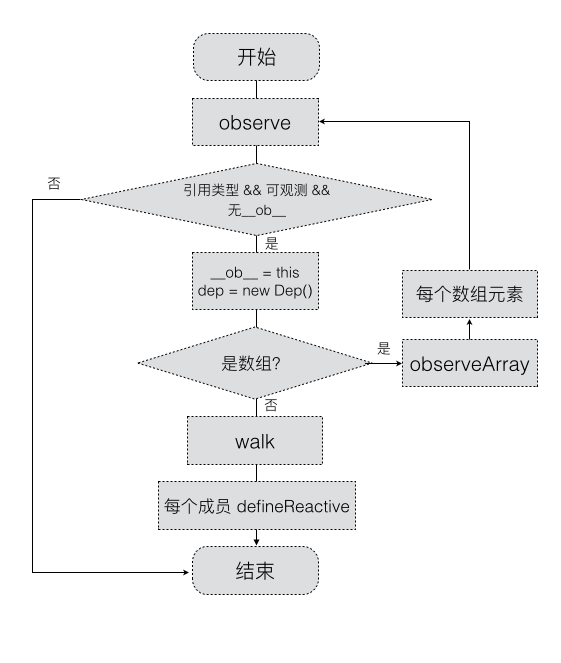

### 为什么要依赖收集 
按照之前《响应式原理》中的方法进行绑定则会出现一个问题——text3在实际模板中并没有被用到，然而当text3的数据被修改（this.text3 = 'test'）的时候，同样会触发text3的setter导致重新执行渲染，这显然不正确。

先看下面这段代码
``` javascript
new Vue({
    template: 
        `<div>
            <span>text1:</span> {{text1}}
            <span>text2:</span> {{text2}}
        <div>`,
    data: {
        text1: 'text1',
        text2: 'text2',
        text3: 'text3'
    }
});
```
按照之前《响应式原理》中的方法进行绑定则会出现一个问题——text3在实际模板中并没有被用到，然而当text3的数据被修改（this.text3 = 'test'）的时候，同样会触发text3的setter导致重新执行渲染，这显然不正确。

### 先谈观察者模式
  观察者模式是一种实现一对多关系解耦的行为设计模式。它主要涉及两个角色：观察目标、观察者
``` javascript
          ----notify---->
  subject---------------- observer
          <---subscribe--
```

特点：观察者要直接订阅观察目标，观察目标一做出通知，观察者就要进行处理

  观察者模式，实现如下：
  ``` javascript
  // 观察者集合
class ObserverList {
    constructor() {
        this.list = [];
    }
    add(obj) {
        this.list.push(obj);
    }
    removeAt(index) {
        this.list.splice(index, 1);
    }
    count() {
        return this.list.length;
    }
    get(index) {
        if (index < 0 || index >= this.count()) {
            return;
        }
        return this.list[index];
    }
    indexOf(obj, start = 0) {
        let pos = start;
        while (pos < this.count()) {
            if (this.list[pos] === obj) {
                return pos;
            }
            pos++;
        }
        return -1;
    }
}
// 观察者类
class Observer {
    constructor(fn) {
        this.update = fn;
    }
}
// 观察目标类
class Subject {
    constructor() {
        this.observers = new ObserverList(); 
    }
    addObserver(observer) {
        this.observers.add(observer);
    }
    removeObserver(observer) {
        this.observers.removeAt(
            this.observers.indexOf(observer)
        );
    }
    notify(context) {
        const count = this.observers.count();
        for (let i = 0; i < count; ++i) {
            this.observers.get(i).update(context);
        }
    }
}


const observer = new Observer((newval) => {
    console.log(`A新值是${newval}`);
})
const subject = new Subject();
subject.addObserver(observer);
// 做出A最新值改变的通知
> subject.notify('Hello, world');
// 控制台输出：
< 'Hello, world'

```

### Vue与Vue的依赖收集
Vue是一个实现数据驱动视图的框架~~（废话，大家都知道，说重点）
我们都知道，Vue能够实现当一个数据变更时，视图就进行刷新，而且用到这个数据的其他地方也会同步变更；而且，这个数据必须是在有被依赖的情况下，视图和其他用到数据的地方才会变更。
所以，Vue要能够知道一个数据是否被使用，实现这种机制的技术叫做依赖收集根据Vue官方文档的介绍，其原理如下图所示：
  

### 依赖收集与观察者模式
在Vue依赖收集里：谁是观察者？谁是观察目标？
显然：
  依赖的数据是观察目标
  视图、计算属性、侦听器这些是观察者

### 从源码解析Vue的依赖收集

1、角色
  Vue源码中实现依赖收集，实现了三个类：

  *  Dep：扮演观察目标的角色，每一个数据都会有Dep类实例，它内部有个subs队列，subs就是subscribers的意思，保存着依赖本数据的观察者，当本数据变更时，调用dep.notify()通知观察者
  *  Watcher：扮演观察者的角色，进行观察者函数的包装处理。如render()函数，会被进行包装成一个Watcher实例
  *  Observer：辅助的可观测类，数组/对象通过它的转化，可成为可观测数据

2、每一个数据都有的Dep类实例
  Dep类实例依附于每个数据而出来，用来管理依赖数据的Watcher类实例
#### Dep
  简单理解就是：谁依赖data.x中的数据，就把这个谁对应生的成watch收集起来并放进data.x对应的dep.subs
              当data.x发生数据发生变化时，就调用dep.notify进行通知dep.subs中的所有watcher
              全局的Dep.target指向当前执行到哪个watcher了
``` javascript
class Dep {
    static target = null;  // 巧妙的设计！
    constructor() {
        this.subs = [];
    }
    addSub(sub) {
        this.subs.push(sub);
    }
    removeSub(sub) {
        this.subs.$remove(sub);
    }
    depend() {
        Dep.target.addDep(this);
    }
    notify() {
        const subs = this.subs.slice();
        for (let i = 0, l = subs.length; i < l; i++) {
            subs[i].update();
        }
    }
}
```
#### watcher
``` javascript
<template>
    <div>{{a}}</div>
</template>
computed: {
    newValue() {
        return this.a + 1;
    }
}
```
那么，template被编译后，会形成AST，在执行render()函数过程中就会触发data.a的getter，并且这个过程是惰性收集的（如newValue虽然用到 了a，但如果它没有被调用执行，就不会触发getter，也就不会被添加到data.a的dep.subs里）

假设template变成了这样子：
``` javascript
<template>
    <div>I am {{a}}，plus 1 is {{newValue}}</div>
</template>
```

那么，可以看到就对应了两个观察者函数：计算属性newValue和render()函数，它们会被包装为两个watcher。<br>
在执行render()函数渲染的过程中，访问了data.a，从而使得data.a的dep.subs里加入了render@watcher<br>
又访问了计算属性newValue，计算属性里访问了data.a，使得data.a的dep.subs里加入了newValue@watcher。<br>
所以data.a的dep.subs里就有了[render@watcher, newValue@watcher]<br>
为什么访问特定数据就使能让数据的deps.subs里加入了watcher呢？<br>
这是因为，在访问getter之前，就已经进入了某个watcher的上下文了(非常重要)，所以有一件事情是可以保证的：Watcher类的实例watcher已经准备好了，并且已经调用了watcher.get()，Dep.target是有值的<br>
所以，我们看到getter里进行依赖收集的写法是dep.depend()，并没有传入什么参数，这是因为，我们只需要把Dep.target加入当前dep.subs里就好了。

总结： get进行收集watcher,set进行通知watcher

vue源码watcher中重要方法实现
``` javascript
export default class Watcher {
  ...
  /**
   * Add a dependency to this directive.
   */
  addDep (dep: Dep) {
    const id = dep.id
    if (!this.newDepIds.has(id)) {
      this.newDepIds.add(id)
      this.newDeps.push(dep)
      if (!this.depIds.has(id)) {
        dep.addSub(this)
      }
    }
  }
}
```
概括起来就是：
  1、判断是否收集过这个依赖，收集过就不再收集，没有收集过就加入newDeps。同时，判断有无缓存过依赖，缓存过就不再加入到dep.subs里了。

  2、setter里进行的，则是在值变更后，通知watcher进行重新计算。由于setter能访问到闭包中dep，所以就能获得dep.subs，从而知道有哪些watcher依赖于当前数据，如果自己的值变化了，通过调用dep.notify()，来遍历dep.subs里的watcher，执行每个watcher的update()方法，让每个watcher进行重新计算。

#### Observer
observe函数
``` javascript
function observe (value, vm) {
    if (!value || typeof value !== 'object') {
        return
    }
    var ob
    if (hasOwn(value, '__ob__') && value.__ob__ instanceof Observer) {
        ob = value.__ob__
    } else if (shouldConvert && (isArray(value) || isPlainObject(value)) && Object.isExtensible(value) && !value._isVue) {
        ob = new Observer(value)
    }
    if (ob && vm) {
        ob.addVm(vm)
    }
    return ob
}
```
总结来说就是：
只为对象/数组 实例一个Observer类的实例，而且就只会实例化一次，并且需要数据是可配置的时候才会实例化Observer类实例。
Observer类实现
``` javascript
class Observer {
    constructor(value) {
        this.value = value
        this.dep = new Dep()
        def(value, '__ob__', this)
        if (isArray(value)) {
            var augment = hasProto
              ? protoAugment
              : copyAugment
            augment(value, arrayMethods, arrayKeys)
            this.observeArray(value)
        } else {
            this.walk(value)
        }
    }
    walk(obj) {
        var keys = Object.keys(obj)
        for (var i = 0, l = keys.length; i < l; i++) {
            this.convert(keys[i], obj[keys[i]])
        }
    }
    observeArray(items) {
        // 对数组每个元素进行处理
        // 主要是处理数组元素中还有数组的情况
        for (var i = 0, l = items.length; i < l; i++) {
            observe(items[i])
        }
    }
    convert(key, val) {
        defineReactive(this.value, key, val)
    }
    addVm(vm) {
        (this.vms || (this.vms = [])).push(vm)
    }
    removeVm(vm) {
        this.vms.$remove(vm)
    }
}
```
总结：
  * 如果value是个对象，就执行walk()过程，遍历对象把每一项数据都变为可观测数据（调用defineReactive方法处理）
  * 如果value是个数组，就执行observeArray()过程，递归地对数组元素调用observe()，以便能够对元素还是数组的情况进行处理

#### 数组
除了对arr重新赋值一个数组外，数组的原生方法的操作（push,pop,shift,unshift,splice,sort,reverse)都不会被setter检测到。所以为了能检测到数组的变更操作，Vue在数组的原型链上定义一系列扩展原生操作方法，以此实现数组变更的检测,即保留原来操作的基础上，加入我们的特定的操作代码。
思路：
  * 保留数组原来的操作
  * push、unshift、splice这些方法，会带来新的数据元素，而新带来的数据元素，我们是有办法得知的（即为传入的参数）
  * 那么新增的元素也是需要被配置为可观测数据的，这样子后续数据的变更才能得以处理。所以要对新增的元素调用observer实例上的observeArray方法进行一遍观测处理
  * 由于数组变更了，那么就需要通知观察者，所以通过ob.dep.notify()对数组的观察者watchers进行通知
比如：
``` javascript
const arrayMethods = Object.create(Array.prototype); 
// 形成：arrayMethods.__proto__ -> Array.prototype
const originalPush = arrayMethods.push;
Object.defineProperty(arrayMethods, 'push', {
    configurable: true,
    enumerable: false,
    writable: true,
    value(...args) {
        const result = originalPush.apply(this, args);
        console.log('对数组进行了push操作，加入了值：', args);
        return result;
    }
})
data.arr.__proto__ = arrayMethods
data.arr.push([5, 6], 7) // 对数组进行了push操作，加入了值：[5, 6], 7 
```
Vue具体的实现如下:
``` javascript
import { def } from '../util/index'

const arrayProto = Array.prototype
export const arrayMethods = Object.create(arrayProto)
const methodsToPatch = [
  'push',
  'pop',
  'shift',
  'unshift',
  'splice',
  'sort',
  'reverse'
]

/**
 * Intercept mutating methods and emit events
 */
methodsToPatch.forEach(function (method) {
  // cache original method
  const original = arrayProto[method]
  def(arrayMethods, method, function mutator (...args) {
    const result = original.apply(this, args)
    const ob = this.__ob__
    let inserted
    switch (method) {
      case 'push':
      case 'unshift':
        inserted = args
        break
      case 'splice':
        inserted = args.slice(2)
        break
    }
    if (inserted) ob.observeArray(inserted)
    // notify change
    ob.dep.notify()
    return result
  })
})
```
### defineReative
Vue2.x实现数据劫持使用的是Object.defineProperty()，而使用Object.defineProperty()来拦截数据的操作，都封装在了defineReactive里。
接下来，我们来解析下defineReactive()源码：

``` javascript
function defineReactive (obj, key, val) {
    var dep = new Dep()
    var property = Object.getOwnPropertyDescriptor(obj, key)
    if (property && property.configurable === false) {
        return
    }
    var getter = property && property.get
    var setter = property && property.set

    var childOb = observe(val)
    Object.defineProperty(obj, key, {
        enumerable: true,
        configurable: true,
        get: function reactiveGetter () {
            var value = getter ? getter.call(obj) : val
            if (Dep.target) {
                dep.depend()
                if (childOb) {
                    childOb.dep.depend()
                }
                if (isArray(value)) {
                    for (var e, i = 0, l = value.length; i < l; i++) {
                        e = value[i]
                        e && e.__ob__ && e.__ob__.dep.depend()
                    }
                }
            }
            return value
        },
        set: function reactiveSetter (newVal) {
            var value = getter ? getter.call(obj) : val
            if (newVal === value) {
                return
            }
            if (setter) {
                setter.call(obj, newVal)
            } else {
                val = newVal
            }
            childOb = observe(newVal)
            dep.notify()
        }
    })
}
```
总结： 
  闭包的妙用：上述代码里Object.defineProperty()里的get/set方法相对于var dep = new Dep()形成了闭包，从而很巧妙地保存了dep实例,这样的话get/set 中都可以进行访问dep


### 总结
总结而言，Vue的依赖收集，是观察者模式的一种应用。其原理总结如图：

1、配置依赖观测

  

2、收集依赖


3、数据值变更

  
