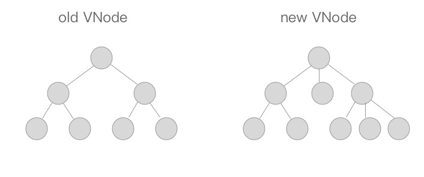

### patch
在Vue中，把 DOM-Diff过程叫做patch过程。diff算法是通过同层的树节点进行比较而非对树进行逐层搜索遍历的方式，所以时间复杂度只有O(n)，是一种相当高效的算法。

其本质都是把对比新旧两份VNode的过程。我们在下面研究patch过程的时候，一定把握住这样一个思想：所谓旧的VNode(即oldVNode)就是数据变化之前视图所对应的虚拟DOM节点，而新的VNode是数据变化之后将要渲染的新的视图所对应的虚拟DOM节点，所以我们要以生成的新的VNode为基准，对比旧的oldVNode，如果新的VNode上有的节点而旧的oldVNode上没有，那么就在旧的oldVNode上加上去；如果新的VNode上没有的节点而旧的oldVNode上有，那么就在旧的oldVNode上去掉；如果某些节点在新的VNode和旧的oldVNode上都有，那么就以新的VNode为准，更新旧的oldVNode，从而让新旧VNode相同。

总之一句话：以新的VNode为基准，改造旧的oldVNode使之成为跟新的VNode一样，这就是patch过程要干的事。

说了这么多，听起来感觉好像很复杂的样子，其实不然，我们仔细想想，整个patch无非就是干三件事：

* 创建节点：新的VNode中有而旧的oldVNode中没有，就在旧的oldVNode中创建。
* 删除节点：新的VNode中没有而旧的oldVNode中有，就从旧的oldVNode中删除。
* 更新节点：新的VNode和旧的oldVNode中都有，就以新的VNode为准，更新旧的oldVNode。

### diff算法介绍




第二层是第一层的children, 第三层 是对应的第二层节点的children,依此类推
这两张图代表旧的VNode与新VNode进行patch的过程，他们只是在同层级的VNode之间进行比较得到变化（第二张图中相同颜色的方块代表互相进行比较的VNode节点），然后修改变化的视图，所以十分高效。

#### patchVnode的规则是这样的：

1. 如果新旧VNode都是静态的，同时它们的key相同（代表同一节点），并且新的VNode是clone或者是标记了once（标记v-once属性，只渲染一次），那么只需要替换elm以及componentInstance即可。

2. 新老节点均有children子节点，则对子节点进行diff操作，调用updateChildren，这个updateChildren也是diff的核心。

3. 如果老节点没有子节点而新节点存在子节点，先清空老节点DOM的文本内容，然后为当前DOM节点加入子节点。

4. 当新节点没有子节点而老节点有子节点的时候，则移除该DOM节点的所有子节点。

5. 当新老节点都无子节点的时候，只是文本的替换。

#### updateChild的规则是这样的:
以"新前"、"新后"、"旧前"、"旧后"的方式开始比对节点
  oldCh:  旧前oldStartIdx/oldStartVnode    旧后oldEndIdx/oldEndVnode, 
  newCh:  新前newStartIdx/newStartVnode    新后newEndIdx/newEndVnode
  
前四种情况其实是指定key的时候，判定为同一个VNode，则直接patchVnode即可，分别比较oldCh以及newCh的两头节点2*2=4种情况<br>
  整体包含在一个循环里面 while (oldStartIdx <= oldEndIdx && newStartIdx <= newEndIdx){]}<br>
1. 新前与旧前节点相同，就把这两个节点进行patch更新，同时oldStartIdx和newStartIdx都加1，后移一个位置<br>
    patchVnode<br>
    ++oldStartIdx<br>
    ++newStartIdx<br>

2. 新后与旧后节点相同，就把这两个节点进行patch更新，同时oldEndIdx和newEndIdx都减1，前移一个位置
    patchVnode<br>
    --oldEndIdx<br>
    --newEndIdx<br>

3. 新后与旧前节点相同，先把这两个节点进行patch更新，然后把旧前节点移动到oldChilren中所有未处理节点之后，最后把oldStartIdx加1，后移一个位置，newEndIdx减1，前移一个位置
    patchVnode<br>
    parent.insertbefor(oldStartVnode,oldEndVnode.nextSibling)<br>
    ++oldStartIdx<br>
    --newEndIdx<br>

4. 如果新前与旧后节点相同，先把两个节点进行patch更新，然后把旧后节点移动到oldChilren中所有未处理节点之前，最后把newStartIdx加1，后移一个位置，oldEndIdx减1，前移一个位置<br>
    patchVnode<br>
    parent.insertBefore(oldEndVnode, oldStartVnode)
    --oldEndIdx<br>
    ++newStartIdx<br>

如果不属于以上四种情况，就进行常规的循环比对patch（ newStartVnode 与 老的children未处理的节点（范围是：(startEndIdx,oldEndIdx)） 之间进行对比，看看 老的未处理的节点 有没有 与 newStartVnode 相同的节点（一种是通过key(老未处理的节点 先根据key,vnode生成map)来找，另一种是遍历老的children未处理的节点 将每一个 与newStartVnode 进行对比）

5. newStartVnode没有key或者是该key没有在老节点中找到, 则为newStartVnode创建一个新的节点createElm
6. 找到相同的了，获取同key的老节点
    * 获取同key的老节点 elmToMove = oldCh[idxInOld]<br>
    * 如果elmToMove不存在： <br>
      - 说明之前已经有新节点放入过这个key的DOM中，提示可能存在重复的key，确保v-for的时候item有唯一的key值<br>
    * 如果elmToMove存在：<br> 
      - 如果新VNode与得到的有相同key的节点是同一个VNode则进行patchVnode（广义的对比两个节点是否一致，sameVnode(elmToMove, newStartVnode)）<br>
        + 因为已经patchVnode进去了，所以将这个老节点赋值undefined，之后如果还有新节点与该节点key相同可以检测出来提示已有重复的key<br>
        + 直接插入oldStartVnode对应的真实DOM节点前面<br>
      - 当新的VNode与找到的同样key的VNode不是sameVNode的时候（比如说tag不一样或者是有不一样type的input标签），创建一个新的节点
7. 全部比较完成以后，发现oldStartIdx > oldEndIdx的话，说明老节点已经遍历完了，新节点比老节点多，所以这时候多出来的新节点需要一个一个创建出来加入到真实DOM中<br>
  addVnodes(newStartIdx, newEndIdx,)
8. 如果全部比较完成以后发现newStartIdx > newEndIdx，则说明新节点已经遍历完了，老节点多余新节点，这个时候需要将多余的老节点从真实DOM中移除<br>
  removeVnodes(oldStartIdx, oldEndIdx)
      
### DOM操作
由于Vue使用了虚拟DOM，所以虚拟DOM可以在任何支持JavaScript语言的平台上操作，譬如说目前Vue支持的浏览器平台或是weex，在虚拟DOM的实现上是一致的。那么最后虚拟DOM如何映射到真实的DOM节点上呢？

Vue为平台做了一层适配层，浏览器平台见/platforms/web/runtime/node-ops.js以及weex平台见/platforms/weex/runtime/node-ops.js。不同平台之间通过适配层对外提供相同的接口，虚拟DOM进行操作真实DOM节点的时候，只需要调用这些适配层的接口即可，而内部实现则不需要关心，它会根据平台的改变而改变。

现在又出现了一个问题，我们只是将虚拟DOM映射成了真实的DOM。那如何给这些DOM加入attr、class、style等DOM属性呢？

这要依赖于虚拟DOM的生命钩子。虚拟DOM提供了如下的钩子函数，分别在不同的时期会进行调用。

const hooks = ['create', 'activate', 'update', 'remove', 'destroy']

``` javascript
/*构建cbs回调函数，web平台上见/platforms/web/runtime/modules*/
for (i = 0; i < hooks.length; ++i) {
  cbs[hooks[i]] = []
  for (j = 0; j < modules.length; ++j) {
    if (isDef(modules[j][hooks[i]])) {
      cbs[hooks[i]].push(modules[j][hooks[i]])
    }
  }
}
```

同理，也会根据不同平台有自己不同的实现，我们这里以Web平台为例。Web平台的钩子函数见/platforms/web/runtime/modules。里面有对attr、class、props、events、style以及transition（过渡状态）的DOM属性进行操作。

以attr为例，代码很简单。
``` javascript
/* @flow */

import { isIE9 } from 'core/util/env'

import {
  extend,
  isDef,
  isUndef
} from 'shared/util'

import {
  isXlink,
  xlinkNS,
  getXlinkProp,
  isBooleanAttr,
  isEnumeratedAttr,
  isFalsyAttrValue
} from 'web/util/index'

/*更新attr*/
function updateAttrs (oldVnode: VNodeWithData, vnode: VNodeWithData) {
  /*如果旧的以及新的VNode节点均没有attr属性，则直接返回*/
  if (isUndef(oldVnode.data.attrs) && isUndef(vnode.data.attrs)) {
    return
  }
  let key, cur, old
  /*VNode节点对应的Dom实例*/
  const elm = vnode.elm
  /*旧VNode节点的attr*/
  const oldAttrs = oldVnode.data.attrs || {}
  /*新VNode节点的attr*/
  let attrs: any = vnode.data.attrs || {}
  // clone observed objects, as the user probably wants to mutate it
  /*如果新的VNode的attr已经有__ob__（代表已经被Observe处理过了）， 进行深拷贝*/
  if (isDef(attrs.__ob__)) {
    attrs = vnode.data.attrs = extend({}, attrs)
  }

  /*遍历attr，不一致则替换*/
  for (key in attrs) {
    cur = attrs[key]
    old = oldAttrs[key]
    if (old !== cur) {
      setAttr(elm, key, cur)
    }
  }
  // #4391: in IE9, setting type can reset value for input[type=radio]
  /* istanbul ignore if */
  if (isIE9 && attrs.value !== oldAttrs.value) {
    setAttr(elm, 'value', attrs.value)
  }
  for (key in oldAttrs) {
    if (isUndef(attrs[key])) {
      if (isXlink(key)) {
        elm.removeAttributeNS(xlinkNS, getXlinkProp(key))
      } else if (!isEnumeratedAttr(key)) {
        elm.removeAttribute(key)
      }
    }
  }
}

/*设置attr*/
function setAttr (el: Element, key: string, value: any) {
  if (isBooleanAttr(key)) {
    // set attribute for blank value
    // e.g. <option disabled>Select one</option>
    if (isFalsyAttrValue(value)) {
      el.removeAttribute(key)
    } else {
      el.setAttribute(key, key)
    }
  } else if (isEnumeratedAttr(key)) {
    el.setAttribute(key, isFalsyAttrValue(value) || value === 'false' ? 'false' : 'true')
  } else if (isXlink(key)) {
    if (isFalsyAttrValue(value)) {
      el.removeAttributeNS(xlinkNS, getXlinkProp(key))
    } else {
      el.setAttributeNS(xlinkNS, key, value)
    }
  } else {
    if (isFalsyAttrValue(value)) {
      el.removeAttribute(key)
    } else {
      el.setAttribute(key, value)
    }
  }
}

export default {
  create: updateAttrs,
  update: updateAttrs
}
```
attr只需要在create以及update钩子被调用时更新DOM的attr属性即可。


### 总结

在本篇文章中我们介绍了Vue中的DOM-Diff算法：patch过程。我们先介绍了算法的整个思想流程，然后通过梳理算法思想，了解了整个patch过程干了三件事，分别是：创建节点，删除节点，更新节点。并且对每件事情都对照源码展开了细致的学习，画出了其逻辑流程图。另外对于更新节点中，如果新旧VNode里都包含了子节点，我们就需要细致的去更新子节点。