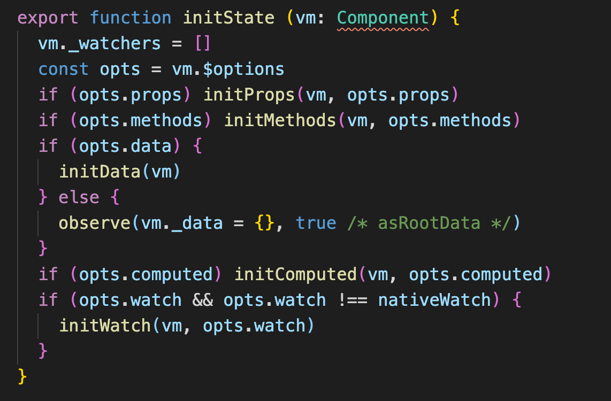
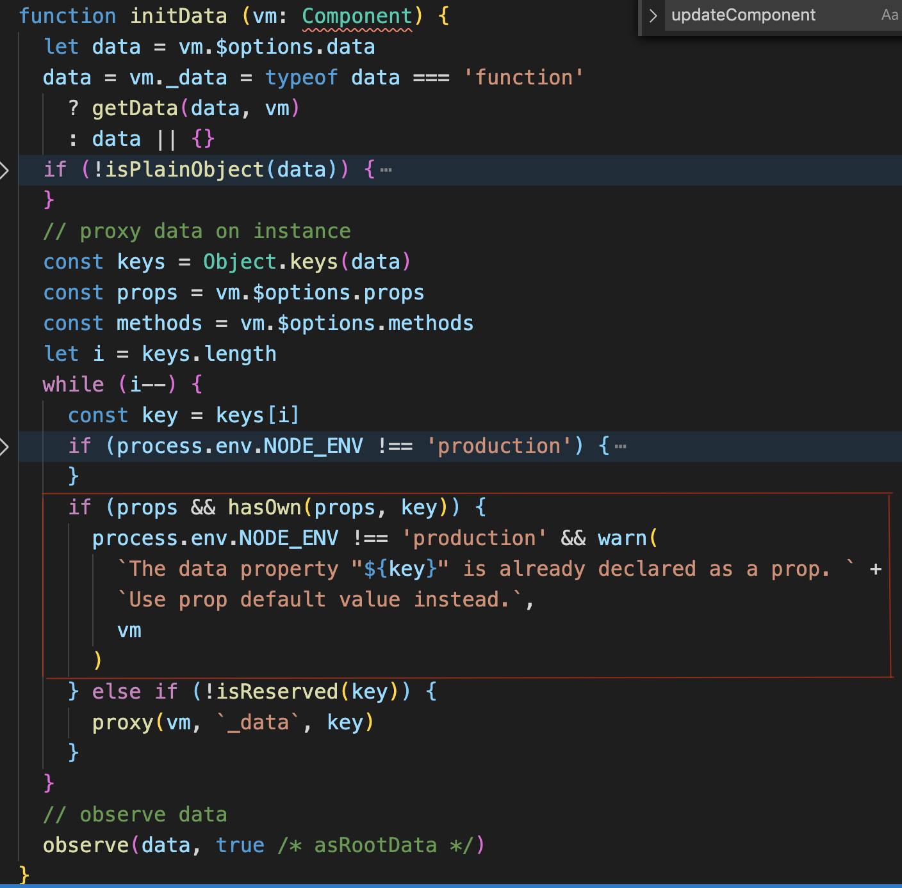

### data props computed 出现同名的数据,优先级的问题
* 只有 data和props出现,props优先级高
* 只有 props和computed出现,computed优先级高
* 只有 data和computed出现,data优先级高
* （data、props）和computed同时出现,computed优先级高

从源码角度来看

处理的顺序：props->methods->data->computed->watch

在initData中对data的处理,并没有将已经出现在props中数据再次代理到vm上，解释只有 data和props出现,props优先级高

在initComputed中对computed的处理,是将没有出现在vm上的数据进行响应式

``` javascript
function initComputed (vm: Component, computed: Object) {
  // $flow-disable-line
  const watchers = vm._computedWatchers = Object.create(null)
  // computed properties are just getters during SSR
  const isSSR = isServerRendering()

  for (const key in computed) {
    const userDef = computed[key]
    const getter = typeof userDef === 'function' ? userDef : userDef.get
    if (process.env.NODE_ENV !== 'production' && getter == null) {
      warn(
        `Getter is missing for computed property "${key}".`,
        vm
      )
    }
    if (!isSSR) {
      // create internal watcher for the computed property.
      watchers[key] = new Watcher(
        vm,
        getter || noop,
        noop,
        computedWatcherOptions
      )
    }
    // component-defined computed properties are already defined on the
    // component prototype. We only need to define computed properties defined
    // at instantiation here.
    if (!(key in vm)) {
      defineComputed(vm, key, userDef)
    } else if (process.env.NODE_ENV !== 'production') {
      if (key in vm.$data) {
        warn(`The computed property "${key}" is already defined in data.`, vm)
      } else if (vm.$options.props && key in vm.$options.props) {
        warn(`The computed property "${key}" is already defined as a prop.`, vm)
      }
    }
  }
}

export function defineComputed (
  target: any,
  key: string,
  userDef: Object | Function
) {
  const shouldCache = !isServerRendering()
  if (typeof userDef === 'function') {
    sharedPropertyDefinition.get = shouldCache
      ? createComputedGetter(key)
      : createGetterInvoker(userDef)
    sharedPropertyDefinition.set = noop
  } else {
    sharedPropertyDefinition.get = userDef.get
      ? shouldCache && userDef.cache !== false
        ? createComputedGetter(key)
        : createGetterInvoker(userDef.get)
      : noop
    sharedPropertyDefinition.set = userDef.set || noop
  }
  if (process.env.NODE_ENV !== 'production' &&
      sharedPropertyDefinition.set === noop) {
    sharedPropertyDefinition.set = function () {
      warn(
        `Computed property "${key}" was assigned to but it has no setter.`,
        this
      )
    }
  }
  Object.defineProperty(target, key, sharedPropertyDefinition)
}
```


### v-if，v-show，v-html
v-if会调用addIfCondition方法，生成vnode的时候会忽略对应节点，render的时候就不会渲染；<br>
v-show会生成vnode，render的时候也会渲染成真实节点，只是在render过程中会在节点的属性中修改show属性值，也就是常说的display；<br>
v-html会先移除节点下的所有节点，调用html方法，通过addProp添加innerHTML属性，归根结底还是设置innerHTML为v-html的值<br>

组件的初次加载是不会调用beforeUpdate/updated方法的
### 根级别的响应式 $set

### 组件的根标签的合并情况以及同名classname 优先级
``` javascript
// B组件文件
<template>
    <div id="myB">123</div>
</template>
<style>
.bb{
  color:blue
}
</style>
// A页面文件 
// 在A页面中使用了B组件
<template>
    <div id="myA">
      <b class="bb"></b>
    </div>
</template>
<style>
.bb{
  color:blue
}
</style>
// 编译后
<style>B样式文件</style>
<style>A样式文件</style>
<div id="myA">
  <div id="myB" class="bb">123</div>
</div>
```
在A中为B定义的样式类会合并到B的根标签上，同时在整个html页面中B的样式文件会放的A的样式文件上面，所以同名的className样式，A中写的样式优先级大于B中写的，故123展示的是blue


