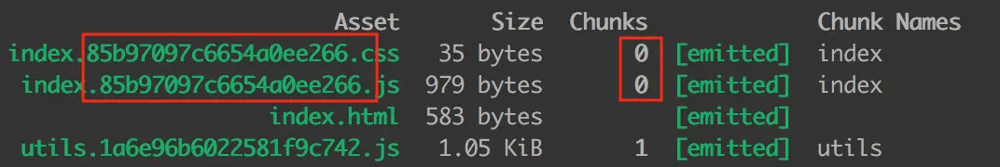
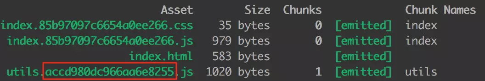
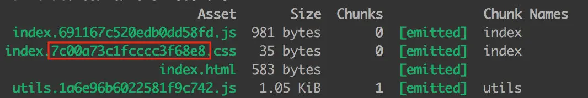
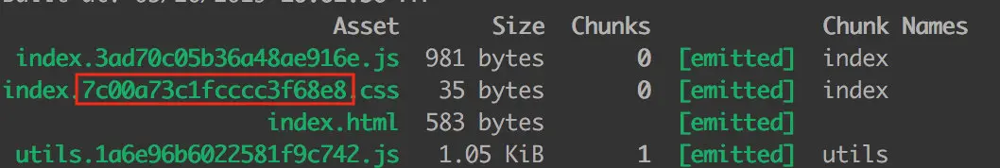

[^_^]: # (## [todo webpack -load] http:www.baidu.com[教程源代码 github 地址])
### webpack 中，module，chunk 和 bundle 的区别是什么？

这里举个例子，给大家形象化的解释一下。

首先我们在 src 目录下写我们的业务代码，引入 index.js、utils.js、common.js 和 index.css 这 4 个文件，目录结构如下：
``` javascript
src/
├── index.css
├── index.html # 这个是 HTML 模板代码
├── index.js
├── common.js
└── utils.js
```
index.css 写一点儿简单的样式：
``` javascript
body {
    background-color: red;
}
``` 
utils.js 文件写个求平方的工具函数：
``` javascript
export function square(x) {
    return x * x;
}
```
common.js 文件写个 log 工具函数：
``` javascript
module.exports = {
  log: (msg) => {
    console.log('hello ', msg)
  }
}
``` 
index.js 文件做一些简单的修改，引入 css 文件和 common.js：
``` javascript
import './index.css';
const { log } = require('./common');

log('webpack');
``` 
webpack 的配置如下：
``` javascript
{
    entry: {
        index: "../src/index.js",
        utils: '../src/utils.js',
    },
    output: {
        filename: "[name].bundle.js", // 输出 index.js 和 utils.js
    },
    module: {
        rules: [
            {
                test: /\.css$/,
                use: [
                    MiniCssExtractPlugin.loader, // 创建一个 link 标签
                    'css-loader', // css-loader 负责解析 CSS 代码, 处理 CSS 中的依赖
                ],
            },
        ]
    }
    plugins: [
        // 用 MiniCssExtractPlugin 抽离出 css 文件，以 link 标签的形式引入样式文件
        new MiniCssExtractPlugin({
            filename: 'index.bundle.css' // 输出的 css 文件名为 index.css
        }),
    ]
}
```
我们运行一下 webpack，看一下打包的结果：


我们可以看出，index.css 和 common.js 在 index.js 中被引入，打包生成的 index.bundle.css 和 index.bundle.js 都属于 chunk 0，utils.js 因为是独立打包的，它生成的 utils.bundle.js 属于 chunk 1。

* 对于一份同逻辑的代码，当我们手写下一个一个的文件，它们无论是 ESM 还是 commonJS 或是 AMD，他们都是 module ；
* 当我们写的 module 源文件传到 webpack 进行打包时，webpack 会根据文件引用关系生成 chunk 文件，webpack 会对这个 chunk 文件进行一些操作；
* webpack 处理好 chunk 文件后，最后会输出 bundle 文件，这个 bundle 文件包含了经过加载和编译的最终源文件，所以它可以直接在浏览器中运行。

一般来说一个 chunk 对应一个 bundle，比如上图中的 utils.js -> chunks 1 -> utils.bundle.js；但也有例外，比如说，我就用 MiniCssExtractPlugin 从 chunks 0 中抽离出了 index.bundle.css 文件。

一句话总结：
* module，chunk 和 bundle 其实就是同一份逻辑代码在不同转换场景下的取了三个名字：
* 我们直接写出来的是 module，webpack 处理时是 chunk，最后生成浏览器可以直接运行的 bundle。

### filename 和 chunkFilename 的区别
* filename
filename 是一个很常见的配置，就是对应于 entry 里面的输入文件，经过webpack 打包后输出文件的文件名。比如说经过下面的配置，生成出来的文件名为 index.min.js。
``` javascript
{
    entry: {
        index: "../src/index.js"
    },
    output: {
        filename: "[name].min.js", // index.min.js
    }
}
``` 

* chunkFilename

chunkFilename 指未被列在 entry 中，却又需要被打包出来的 chunk 文件的名称。一般来说，这个 chunk 文件指的就是要懒加载的代码。

比如说我们业务代码中写了一份懒加载 lodash 的代码：
``` javascript
// 文件：index.js

// 创建一个 button
let btn = document.createElement("button");
btn.innerHTML = "click me";
document.body.appendChild(btn);

// 异步加载代码
async function getAsyncComponent() {
    var element = document.createElement('div');
    const { default: _ } = await import('lodash');

    element.innerHTML = _.join(['Hello!', 'dynamic', 'imports', 'async'], ' ');

    return element;
}
``` 

// 点击 button 时，懒加载 lodash，在网页上显示 Hello! dynamic imports async
``` javascript
btn.addEventListener('click', () => {
    getAsyncComponent().then(component => {
        document.body.appendChild(component);
    })
})
``` 
我们的 webpack 不做任何配置，还是原来的配置代码：
``` javascript
{
    entry: {
        index: "../src/index.js"
    },
    output: {
        filename: "[name].min.js", // index.min.js
    }
}
``` 
这时候的打包结果如下：

这个 1.min.js 就是异步加载的 chunk 文件。文档里这么解释：

output.chunkFilename 默认使用 [id].js 或从 output.filename 中推断出的值（[name] 会被预先替换为 [id] 或 [id].）

文档写的太抽象，我们不如结合上面的例子来看：

* output.filename 的输出文件名是 [name].min.js，[name] 根据 entry 的配置推断为 index，所以输出为 index.min.js；
* 由于 output.chunkFilename 没有显示指定，就会把 [name] 替换为 chunk 文件的 id 号，这里文件的 id 号是 1，所以文件名就是 1.min.js。

如果我们显式配置 chunkFilename，就会按配置的名字生成文件：
``` javascript
{
    entry: {
        index: "../src/index.js"
    },
    output: {
        filename: "[name].min.js",  // index.min.js
        chunkFilename: 'bundle.js', // bundle.js
    }
}
```

一句话总结：
* filename 指列在 entry 中，打包后输出的文件的名称。
* chunkFilename 指未列在 entry 中，却又需要被打包出来的文件的名称(懒加载)。

### webpackPrefetch、webpackPreload 和 webpackChunkName 到底是干什么的？

这几个名词其实都是 webpack 魔法注释（magic comments）里的，文档中说了 6 个配置，配置都可以组合起来用。我们说说最常用的三个配置。

#### webpackChunkName

前面举了个异步加载 lodash 的例子，我们最后把 output.chunkFilename 写死成 bundle.js。在我们的业务代码中，不可能只异步加载一个文件，所以写死肯定是不行的，但是写成 [name].bundle.js 时，打包的文件又是意义不明、辨识度不高的 chunk id。
``` javascript
{
    entry: {
        index: "../src/index.js"
    },
    output: {
        filename: "[name].min.js",  // index.min.js
        chunkFilename: '[name].bundle.js', // 1.bundle.js，chunk id 为 1，辨识度不高
    }
}
``` 

这时候 webpackChunkName 就可以派上用场了。我们可以在 import 文件时，在 import 里以注释的形式为 chunk 文件取别名：
``` javascript
async function getAsyncComponent() {
    var element = document.createElement('div');
  
    // 在 import 的括号里 加注释 /* webpackChunkName: "lodash" */ ，为引入的文件取别名
    const { default: _ } = await import(/* webpackChunkName: "lodash" */ 'lodash');

    element.innerHTML = _.join(['Hello!', 'dynamic', 'imports', 'async'], ' ');

    return element;
}
``` 
这时候打包生成的文件是这样的：

现在问题来了，lodash 是我们取的名字，按道理来说应该生成 lodash.bundle.js 啊，前面的 vendors~ 是什么玩意？

其实 webpack 懒加载是用内置的一个插件 SplitChunksPlugin 实现的，这个插件里面有些默认配置项，比如说 automaticNameDelimiter，默认的分割符就是 ~，所以最后的文件名才会出现这个符号。

#### webpackPrefetch 和 webpackPreload

* 这两个配置一个叫预拉取（Prefetch），一个叫预加载（Preload），两者有些细微的不同，我们先说说 webpackPrefetch。
* 在上面的懒加载代码里，我们是点击按钮时，才会触发异步加载 lodash 的动作，这时候会动态的生成一个 script 标签，加载到 head 头里：

如果我们 import 的时候添加 webpackPrefetch：

``` javascript
const { default: _ } = await import(/* webpackChunkName: "lodash" */ /* webpackPrefetch: true */ 'lodash');
``` 
就会以 <link rel="prefetch" as="script"> 的形式预拉取 lodash 代码：

这个异步加载的代码不需要手动点击 button 触发，webpack 会在父 chunk 完成加载后，闲时加载 lodash 文件。

webpackPreload 是预加载当前导航下可能需要资源，他和 webpackPrefetch 的主要区别是：

* preload chunk 会在父 chunk 加载时，以并行方式开始加载。prefetch chunk 会在父 chunk 加载结束后开始加载。
* preload chunk 具有中等优先级，并立即下载。prefetch chunk 在浏览器闲置时下载。
* preload chunk 会在父 chunk 中立即请求，用于当下时刻。prefetch chunk 会用于未来的某个时刻

一句话总结：
* 这webpackChunkName 是为预加载的文件取别名，webpackPrefetch 会在浏览器闲置下载文件，
* webpackPreload 会在父 chunk 加载时并行下载文件。

### hash、chunkhash、contenthash 有什么不同？

首先来个背景介绍，哈希一般是结合 CDN 缓存来使用的。如果文件内容改变的话，那么对应文件哈希值也会改变，对应的 HTML 引用的 URL 地址也会改变，触发 CDN 服务器从源服务器上拉取对应数据，进而更新本地缓存。

#### hash
hash 计算是跟整个项目的构建相关，我们做一个简单的 demo。

沿用案例 1 的 demo 代码，文件目录如下：
``` javascript
src/
├── index.css
├── index.html
├── index.js
└── utils.js
```
webpack 的核心配置如下（省略了一些 module 配置信息）：
``` javascript
{
    entry: {
        index: "../src/index.js",
        utils: '../src/utils.js',
    },
    output: {
        filename: "[name].[hash].js",  // 改为 hash
    },
    
    ......
    
    plugins: [
        new MiniCssExtractPlugin({
            filename: 'index.[hash].css' // 改为 hash
        }),
    ]
}
```
生成的文件名如下：


我们可以发现，生成文件的 hash 和项目的构建 hash 都是一模一样的。

#### chunkhash

因为 hash 是项目构建的哈希值，项目中如果有些变动，hash 一定会变，比如说我改动了 utils.js 的代码，index.js 里的代码虽然没有改变，但是大家都是用的同一份 hash。hash 一变，缓存一定失效了，这样子是没办法实现 CDN 和浏览器缓存的。

chunkhash 就是解决这个问题的，它根据不同的入口文件(Entry)进行依赖文件解析、构建对应的 chunk，生成对应的哈希值。

我们再举个例子，我们对 utils.js 里文件进行改动：
``` javascript
export function square(x) {
    return x * x;
}

// 增加 cube() 求立方函数
export function cube(x) {
    return x * x * x;
}
``` 
然后把 webpack 里的所有 hash 改为 chunkhash：
``` javascript
{
    entry: {
        index: "../src/index.js",
        utils: '../src/utils.js',
    },
    output: {
        filename: "[name].[chunkhash].js", // 改为 chunkhash
    },
          
    ......
    
    plugins: [
        new MiniCssExtractPlugin({
            filename: 'index.[chunkhash].css' // // 改为 chunkhash
        }),
    ]
}
```
构建结果如下：



我们可以看出，chunk 0 的 hash 都是一样的，chunk 1 的 hash 和上面的不一样。
假设我又把 utils.js 里的 cube() 函数去掉，再打包：



对比可以发现，只有 chunk 1 的 hash 发生变化，chunk 0 的 hash 还是原来的。
contenthash

我们更近一步，index.js 和 index.css 同为一个 chunk，如果 index.js 内容发生变化，但是 index.css 没有变化，打包后他们的 hash 都发生变化，这对 css 文件来说是一种浪费。如何解决这个问题呢？

#### contenthash 

将根据资源内容创建出唯一 hash，也就是说文件内容不变，hash 就不变。
我们修改一下 webpack 的配置：

``` javascript
{
    entry: {
        index: "../src/index.js",
        utils: '../src/utils.js',
    },
    output: {
        filename: "[name].[chunkhash].js",
    },
      
    ......
    
    plugins: [
        new MiniCssExtractPlugin({
            filename: 'index.[contenthash].css' // 这里改为 contenthash
        }),
    ]
}
```

我们对 index.js 文件做了 3  次修改（就是改了改 log 函数的输出内容，过于简单就先不写了），然后分别构建，结果截图如下：






我们可以发现，css 文件的 hash 都没有发生改变。
一句话总结：

* hash 计算与整个项目的构建相关；
* chunkhash 计算与同一 chunk 内容相关；
* contenthash 计算与文件内容本身相关。

### sourse-map 中 eval、cheap、inline 和 module 各是什么意思？

sourse-map ，里面都有个 map 了，肯定是映射的意思。sourse-map 就是一份源码和转换后代码的映射文件。具体的原理内容较多，感兴趣的同学可以自行搜索，我这里就不多言了。

我们先从官网上看看 sourse-map 有多少种类型：


emmmm，13 种。

如果再仔细看一下，就发现这 13 种大部分都是 eval、cheap、inline 和 module这 4 个词排列组合的，我做了个简单的表格，比官网上直白多了：

|  参数   | 参数解释  |
|  ----  | ----  |
| eval  | 打包后的模块都使用 eval() 执行，行映射可能不准；不产生独立的 map 文件 |
| cheap  | map 映射只显示行不显示列，忽略源自 loader 的 source map |
|  inline  | 映射文件以 base64 格式编码，加在 bundle 文件最后，不产生独立的 map 文件  |
|  module  | 增加对 loader source map 和第三方模块的映射  |


可以看看 demo。
我们对 webpack 做一些配置，devtool 是专门配置 source-map 的。
``` javascript

{
    devtool: 'source-map',
}
```
index.js 文件为了简便，我们只写一行代码，为了得出报错信息，我们故意拼错：

``` javascript
console.lg('hello source-map !') // log 写成 lg
``` 
下面我们试一试常见的几个配置：

#### source-map

source-map 是最大而全的，会生成独立 map 文件：


注意下图光标的位置，source-map 会显示报错的行列信息：


#### cheap-sourse-map

cheap，就是廉价的意思，它不会产生列映射，相应的体积会小很多，我们和 sourse-map 的打包结果比一下，只有原来的 1/4 。


#### eval-source-map
eval-source-map 会以 eval() 函数打包运行模块，不产生独立的 map 文件，会显示报错的行列信息：


``` javscript
// index.bundle.js 文件

!function(e) {
    // ......
    // 省略不重要的代码
    // ......
}([function(module, exports) {
    eval("console.lg('hello source-map !');//# sourceURL=[module]\n//# sourceMappingURL=data:application/json;charset=utf-8;base64,eyJ2ZXJzaW9uIjozLCJzb3VyY2VzIjpbIndlYnBhY2s6Ly8vLi4vc3JjL2luZGV4Mi5qcz9mNmJjIl0sIm5hbWVzIjpbImNvbnNvbGUiLCJsZyJdLCJtYXBwaW5ncyI6IkFBQUFBLE9BQU8sQ0FBQ0MsRUFBUixDQUFXLG9CQUFYIiwiZmlsZSI6IjAuanMiLCJzb3VyY2VzQ29udGVudCI6WyJjb25zb2xlLmxnKCdoZWxsbyBzb3VyY2UtbWFwICEnKSJdLCJzb3VyY2VSb290IjoiIn0=\n//# sourceURL=webpack-internal:///0\n")
}
]);
```

#### inline-source-map
映射文件以 base64 格式编码，加在 bundle 文件最后，不产生独立的 map 文件。加入 map 文件后，我们可以明显的看到包体积变大了；


``` javascript
// index.bundle.js 文件

!function(e) {

}([function(e, t) {
    console.lg("hello source-map !")
}
]);
//# sourceMappingURL=data:application/json;charset=utf-8;base64,eyJ2ZXJzaW9uIjozLCJzb3VyY2VzIjpbIndlYnBhY2s6Ly8vd2VicGFjay9ib290c3RyYXAiLCJ3ZWJwYWNrOi8vLy4uL3NyYy9pbmRleDIuanMiXSwibmFtZXMiOlsiaW5zdGFsbGVkTW9kdWxlcyIsIl9fd2VicGFja19yZXF1aXJ......
// base64 太长了，我删了一部分，领会精神
```

常用配置：

上面的几个例子都是演示，结合官网推荐和实际经验，常用的配置其实是这几个：

1. source-map

大而全，啥都有，就因为啥都有可能会让 webpack 构建时间变长，看情况使用。
2. cheap-module-eval-source-map

这个一般是开发环境（dev）推荐使用，在构建速度报错提醒上做了比较好的均衡。
3. cheap-module-source-map

一般来说，生产环境是不配 source-map 的，如果想捕捉线上的代码报错，我们可以用这个
